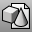

---
---

{: #kanchor1206}{: #kanchor1207}{: #kanchor1208}{: #kanchor1209}{: #kanchor1210}{: #kanchor1211}{: #kanchor1212}{: #kanchor1213}
# Insert
 [Where can I find this command?](javascript:void(0);) Toolbars
 [File](file-toolbar.html)  [Block](block-toolbar.html) 
Menus
Edit
Blocks
Insert Block Instance
File
Insert
Shortcut
 [Ctrl](ctrl-key.html) +I
The Insert command inserts [block](block.html) objects stored in the file or [imports](import.html) an external file.
Steps
Select a block name or clickFileto insert an external file.In theInsertdialog box, choose options.Note
When you insert a file with the same layer names but with different hierarchies into another, the inserted file's layer hierarchy will be modified to match that of the current file.When you insert a file with the same block name but different geometry or base point, the block name is incremented.Insert options
 **Name** 
Lists the names of blocks defined in the model.
 **File** 
Click to insert an external file.
Embedded Block / Linked to file / Embedded and linked to file
The status of the selected block.
URL
The URL attached to the block definition.
Description
The description attached to the block definition.
Insert as
Block instance
Inserts the model as a [block](block.html) instance.
Group
Inserts the model as a [group](group.html).
Individual objects
Inserts the model as individual geometry objects.
Block preview image
Right-click menu
Sets the [display mode](view-displaymode-options.html) and the [view](setview.html).
Wireframe
Shaded
Rendered
Top
Bottom
Left
Right
Back
Perspective
Insertion point
Prompt
Prompts to pick an insertion point.
X/Y/Z
Type the x, y, and z coordinates.
Scale
Scales the objects.
Prompt
Prompts to pick a scale.
Uniform
Sets the same scale for the x, y, and z&#160;directions.
X/Y/Z
Sets a separate scale for each direction.
Rotation
Rotates the objects.
Prompt
Prompts to pick a rotation angle.
Angle
Sets a rotation angle.
Insert File options
Block definition name
The file name and preview.
External file
Read linked blocks from this file
If the external file contains linked blocks, these will be inserted.
Block definition type
Embed
Inserts geometry into the current file. This will not update if the external file changes.
Embed and link
Inserts geometry into the current file and maintain a link to the external file. Linked geometry can be updated when the external file changes. See: [BlockManager](blockmanager.html). If the external file cannot be located, the geometry is still defined in the current file.
Link{: #link}
Maintains a link to the external file only. Linked geometry is updated when the external file changes. See: [BlockManager](blockmanager.html). If the external file cannot be located, the geometry will not appear in the current file.
Layer style *(Linked blocks only)* 
A linked block definition references an external file. Each time a model containing a linked block definition is loaded, Rhino reads the referenced file to create the contents of the linked block definition. When you create a linked block definition, specify one of two linked block definition layer styles.
Active
All layers for the linked block definition are saved in the active model. All layer attributes, including rendering material, can be edited and are saved. For each layer in the linked model, if there is a layer in the current model with a matching short name, that layer is used, otherwise a new layer is created.
Reference
The layer tree from the linked model is added to the current model as *reference layers* under a "grandparent" layer with the same name as the linked file. All of the added layers are *reference layers*. Only the [on/off](layer.html#on), [locked/unlocked](layer.html#lock) states and the layer [color](layer.html#displaycolor) can be modified.
Description
The description attached to the block definition.
Hyperlink
URL
The URL attached to the block definition.
Description
The description of the URL.
See also
 [Work with blocks, groups, and worksessions](sak-blocksgroups.html) 
 [Rhino Wiki: Imported and linked block layer names](http://wiki.mcneel.com/rhino/rhinov5status_layernames#examplelinked_block_layer_names) 
&#160;
&#160;
Rhinoceros 6 © 2010-2015 Robert McNeel &amp; Associates.11-Nov-2015
 [Open topic with navigation](insert.html) 

