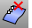

---
---

{: #kanchor1226}{: #kanchor1227}{: #kanchor1228}{: #kanchor1229}{: #kanchor1230}{: #kanchor1231}{: #kanchor1232}{: #kanchor1233}{: #kanchor1234}{: #kanchor1235}{: #kanchor1236}
# InsertKnot
 [Where can I find this command?](javascript:void(0);) Toolbars
 [Point Edit](point-edit-toolbar.html)  [Organic](organic-toolbar.html) 
Menus
Edit
Control Points
Insert Knot
The InsertKnot command adds [knots](knot.html) in curves or surfaces.
Steps
 [Select](select-objects.html) the object.Pick a location for the knot.Note:
Inserting a [knot](knot.html) in a surface also displays an [isoparametric curves](isocurve.html) at the knot location if isoparametric curves are being displayed.The status bar distance pane displays the parameter value when inserting a knot to a curve. You can also type a parameter value to add a new knot.Command-line options
Automatic
Adds a [knot](knot.html) /knot line halfway between existing knots to maintain as uniform a structure as possible.
Increases the knot density of a curve or surface to add more control points while maintaining an even knot distribution for better point pulling behavior.
Midpoints
Places markers half-way between the existing knots/knot lines that can act as guides for inserting knots midway between existing knots.
Symmetrical
Adds knots on both sides of the center of the curve or surface.
Undo
The Undo option reverses the last action.
Direction(Surfaces only)
Specify the u, v, or both [directions](curvesurfacedirection.html).
Toggle(Surfaces only)
Toggles the [direction](curvesurfacedirection.html) between u and v.

# RemoveKnot
{: #removeknot}
 [Where can I find this command?](javascript:void(0);) Toolbars
 [Organic](organic-toolbar.html)  [Point Edit](point-edit-toolbar.html) 
Menus
Edit
Control Points
Remove Knot
The RemoveKnot command deletes a [knot](knot.html) from a curve or surface.
Steps
 [Select](select-objects.html) a curve or surface.Click the knot to remove and press [Enter](enter-key.html) .The RemoveKnot command can be used to remove the connecting joint between two joined curves. The resulting curve will not [Explode](explode.html) into separate parts.
Command-line options
Direction(Surfaces only)
Specify the u, v, or both [directions](curvesurfacedirection.html).
Toggle(Surfaces only)
Toggles the [direction](curvesurfacedirection.html) between u and v.
Undo
The Undo option reverses the last action.

# RemoveMultiKnot
{: #removemultiknot}
 [Where can I find this command?](javascript:void(0);) Toolbars
 [Surface Tools](surface-tools-toolbar.html) 
Menus
 [Not on menus.](menuwhattodo.html) 
The RemoveMultiKnot command removes multiple but not fully-multiple [knots](knot.html) from curves and surfaces.
Notes
Multiple knots means more than one knot at a location. Fully-multiple knots means as many as possible at a location, which is equal to the degree.There may be a [kink](kink.html) at that point that is desired. Surfaces created with the [Sweep2](sweep2.html), [BlendSrf](blendsrf.html), and [OffSetSrf](offsetsrf.html) commands can be built with multiple knots.The Simple Sweep option in the [Sweep2](sweep2.html) dialog box makes surfaces that do not have multiple knots, but this option is only available in restricted cases where all the curves are perfectly matched and correctly placed. The usual behavior of the [Sweep2](sweep2.html) command allows accurate sweeps to be made from diverse input.The RemoveMultiKnot command removes these stacked knots if they are not fully multiple. Removing the multiple knots can cause some loss in the surface precision, but in practice, this is usually not a problem.The advantage to removing these knots is that the surface point count is reduced.See also
 [Edit objects using control points](sak-pointediting.html).
 [Edit surfaces](sak-surfacetools.html) 
&#160;
&#160;
Rhinoceros 6 © 2010-2015 Robert McNeel &amp; Associates.11-Nov-2015
 [Open topic with navigation](insertknot.html) 

