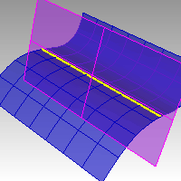

---
---

{: #kanchor1246}{: #kanchor1247}{: #kanchor1248}
# Intersect
 [Where can I find this command?](javascript:void(0);) Toolbars
 [Curve From Object](curve-from-object-toolbar.html) 
Curve
Menus
Curve
Curve From Objects
Intersection
 [&#160;History enabled](historyenabled.html) 
The Intersect command creates point objects or curves at the intersection of at least two curves and surfaces.

Steps
 [Select objects](select-objects.html) .This creates a curve or point object at the intersection of the two objects.Infinite Plane: TypeIPfor [InfinitePlane](infiniteplane.html) options.

Note
Intersecting curves with other curves or surfaces results in curves or point objects.Intersecting surfaces or polysurfaces with surfaces or polysurfaces results in curves.To create surface and solid intersections, use the [BooleanIntersection](booleanintersection.html) command.See also
 [Create curves from other objects](sak-curvefromobject.html) 
&#160;
&#160;
Rhinoceros 6 © 2010-2015 Robert McNeel &amp; Associates.11-Nov-2015
 [Open topic with navigation](intersect.html) 

