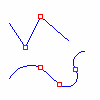

---
---

Kink{: #kanchor3095}
A kink is a point where a curve dramatically changes direction. The corners of a rectangle are kinks. Kinks can also happen at a point where a curve dramatically changes its the amount it curves. For example a rounded rectangle has kinks where the line segments turn into arcs.
The red points mark the locations of kinks in the curves.

 [Open topic with navigation](kink.html) 

