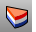
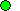
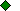

---
---

{: #kanchor271}{: #kanchor272}{: #kanchor273}{: #kanchor274}{: #kanchor275}{: #kanchor276}{: #kanchor277}{: #kanchor278}{: #kanchor279}{: #kanchor280}{: #kanchor281}{: #kanchor282}{: #kanchor283}{: #kanchor284}{: #kanchor285}{: #kanchor286}{: #kanchor287}{: #kanchor288}{: #kanchor289}{: #kanchor290}{: #kanchor291}{: #kanchor292}{: #kanchor293}{: #kanchor294}{: #kanchor295}{: #kanchor296}{: #kanchor297}{: #kanchor298}{: #kanchor299}{: #kanchor300}{: #kanchor301}{: #kanchor302}{: #kanchor303}
# Layer
 [Where can I find this command?](javascript:void(0);) Toolbars
 [Layer](layer-toolbar.html)  [Standard](standard-toolbar.html) 
Menus
Edit
Layers
Edit Layers
Panels
Layers
The Layer command manages layer properties.
Layers are a way of organizing objects so you can manipulate them all at once or keep track of them in some way. When objects are on a layer, you can turn them all off at once, change their [wireframe](view-displaymode-options.html#wireframe) display color, and select them all with one selection.
Layers Panel
 [Panel options](panel-options.html) 
TheLayerspanel displays the layers in the model.
When a layout view is involved, an extended set of columns displays.
{: #kanchor304}When linked blocks or worksessions are involved, layers from those external files are displayed in a tree format under the block name.
The layer panel gives you tools for managing the layers in your model.
TheLayerspop-up menu gives you access to common layer settings: on/off, locked/unlocked, color, and current status.
To display a shortcut window
 [Click](mouse-buttons.html) the [Layer pane](rhino-window.html#layer) in the status bar.TheLayerspop-up menu gives you access to a shortcut list of layer options.Note
If no objects are selected, selecting a layer from the status bar layer pop-up window sets the selected layer as the current layer.If objects are selected, selecting a layer from the status bar layer pop-up window changes the objects to the selected layer. The current layer is not changed.The status bar [Layer pane](rhino-window.html#layer) shows the current layer unless objects are selected. When objects are selected, the status bar [Layer pane](rhino-window.html#layer) shows the layer of select objects or "varies" if objects fell on more than one layer.{: #to-open-the-layers-panel}To open the Layers panel
 [Right-click](mouse-buttons.html) the [Layer pane](rhino-window.html#layer) in the status bar.OrOn thePanelsmenu, clickLayers.Layer Properties
Name{: #name}
Layer name.
Current{: #current}
A check and [shading](appearance-colors.html#layerdialog) indicates current layer.
On/Off (Layout On/Off and Detail On/Off)
On
{: #on}The layer is visible and you can see and select objects on this layer.
Off
The layer is not visible and you cannot see objects on this layer.
Lock/Unlock{: #lock}
Unlock
The layer is visible, and you can edit objects on this layer.
Lock
The layer is visible, but you cannot edit objects on this layer.
Color{: #displaycolor}
The default screen display color for objects on this layer.
Material{: #material}
The [material](materialeditor.html) used for rendering.
Linetype{: #linetype}
The linetype assigned to the layer.
Print Color{: #printcolor}
The color assigned to the layer for printing only.
{: #printwidth}Print Width
Opens theSelect Print Widthdialog. Specify a line width assigned to the layer for printing only or specifyNo Printif you do not want the layer to print.
Layout On/Off
{: #on}When on, the layer is visible and you can see objects on this layer in a layout or detail.
Layout / Detail Color{: #displaycolor}
The default screen display color for objects on this layer in a layout or detail.
Layout / Detail Print Color{: #printcolor}
The color assigned to the layout or detail layer for printing only.
{: #printwidth}Layout / Detail Print Width
The line width assigned to the layer for printing only. Specify a line width assigned to the layer for printing only or specifyNo Printif you do not want the layer or detail to print.
Change the properties of individual objects with the [Properties](properties.html) command.

## Layer Toolbar options
New Layer
Layer names are created with incremented numbers. Edit the layer to change its name. In addition to using the context menu, you can select the layer and click the layer name or press F2. Both of these actions will highlight the layer name so you can type a new one.
Layer names on the same level must be unique.
Tab key
Tab
While editing a layer name, pressTabto save the layer and create a new layer. This lets you create multiple layer names more easily.
New Sublayer
Creates a new layer subordinate to the selected layer.
Layers can be dragged under other layers to make them sub-layers.
Sublayer names under a parent layer must be unique.
Delete
If a layer you want to delete has objects on it, a warning dialog appears.
Move Up
Move the selected layers up in the list.
Move Down
Move the selected layers down in the list.
Move Up One Parent
Moves the selected layer up one level in the layer tree structure.
Filters
When a model has a large number of layers, the list of layers may be difficult to manage. Layer filters let you adjust the visibility of the layers in the panel.
Layer Filter Options
All Layers
On Layers
Off Layers
Locked Layers
Unlocked Layers
Layers with Objects
Empty Layers
Selected Layers
Filtered Layers
Opens theShow Filtered Layersdialog box to set a custom filter.
Show Filtered Layers options
Match:
Type a string of characters to match the layer name to. You can include wildcard characters:
*= match zero or more characters?= exactly one character#= exactly one numeric (0-9) character&amp;= exactly one alpha (a-z, A-Z) character
Set the layer attributes to match (on, off, or locked, and whether or not there are objects on the layer).
And are:
On
Off
Locked
Unlocked
And have:
Objects
No objects
View *(Layout viewports only)* 
When a layout view is active, allows restricting the layers to layout layers only.
View all layer settings
Displays model and layout layer settings columns.
View model layer settings
Displays model layer settings columns:
Current
On
Lock
Color
Linetype
Print Color
Print Width
View layout layer settings
Displays layout settings columns:
Layout On
Layout Color
Layout Print Color
Layout Print Width
Tools
Layer State Manager
Opens the [Layer States](layerstatemanager.html) panel.
Select All
Select all layers currently displayed in the list.
Select Object Layer
Selects the layer of the currently selected object.
Invert Selection
Inverts the selection state. All selected layers are unselected and all unselected layers are selected.
Select Objects
Select objects for on the currently selected layer.
Select Sublayer Objects
Selects object on the currently selected layer and its sub-layers.
Change Object Layer
Change selected objects to selected layer.
See: [ChangeLayer](#changelayer).

Copy Objects to Layer
Copy selected objects to selected layer.
Collapse All
Hide all child layers.
Expand All
Show all child layers.
Columns
Select which columns to display in the Layer panel.
Column Sort
Allows layers to be sorted by columns. Clear the check to prevent accidental sorting by name.
Layer list options
To sort the list
Click the column heading.To hide or show columns
 [Right-click](mouse-buttons.html) the column heading, and check or clear the column name.To change a column width
Drag the column heading dividers.To edit a layer's properties
 [Right-click](mouse-buttons.html) the layer name and select an option from the context menu, or select an option from the Layer Toolbar.To select layers
Click and drag the cursor over a list of layers to select them.Hold [Shift](shift-key.html) to select a group of adjacent layer names.Hold [Ctrl](ctrl-key.html) to select multiple individual layer names.To quickly select all but a few layers,Select all layers, de-select a smaller set of layers.Layer context menu options
To open the layer context menu
 [Right-click](mouse-buttons.html) a layer name.Worksession Reference *(Worksession layers only)* 
For more information, see [Worksession](worksession.html).
Set Active Model
The selected model is open for editing.
The current model closes and becomes an attached model. You are prompted to save changes in the currently active model.
Detach Model
Removes the external file from the worksession list.
Update Model
Refreshes the selected attached files.
Attach Model
Attaches an external file to the worksession list.
Set Current
Makes the selected layer current.
Set Properties
On
{: #on}The layer is visible and you can see objects on this layer.
Off
The layer is not visible and you cannot see objects on this layer.
Lock
The layer is visible, but you cannot edit objects on this layer.
Unlock
The layer is visible and you can edit objects on this layer.
Color
Sets the default screen display color for objects on this layer.
Material
Sets the material used for rendering.
Linetype
Sets the linetype assigned to the layer.
Print Color
Sets the color assigned to the layer for printing only.
Print Width
Sets the line width assigned to the layer for printing only.
OneLayerOn
Sets the selected layer on and turns all others off.
See: [OneLayerOn](onelayeron.html).
Match Properties
Select a layer to match.
See: [MatchProperties](matchproperties.html).
Remove Material *(Material column only)* 
Restores the layer material to the default material.
Reset Print Color *(Print color column only)* 
Resets the print color to the layer color.
New Layer
Creates a new layer.
New Sublayer
Creates a new sublayer.
Rename Layer
Renames the current layer.
Delete Layer
Deletes the selected layers.
Duplicate Layer
Copies the layer with its attributes.
Duplicate Layer and Objects
Copies the layer with its attributes and all of the objects on the layer.
See: [DupLayer](duplayer.html).
Select All
Selects all layers currently displayed in the list.
Invert selection
Inverts the selection state. All selected layers are unselected and unselected layers are selected.
Select Objects
Selects objects on the selected layers.
Select Sublayer Objects
Selects objects on the sub-layers of the selected layer.
Change Object Layer
Selects objects in the model to change to selected layer.
Copy Objects to Layer
Selects objects to copy to selected layer.
Collapse Sublayers
Collapses the layer name tree.
Expand Sublayers
Expands the layer name tree for the selected layer.

### Layer Keyboard Shortcuts
Standard list control shortcuts
▲
Moves the selection up.▼Moves the selection down.PageUpMoves the selection a page up.PageDownMoves the selection a page down.HomeMoves the selection to the first item.EndMoves the selection to the last item. [Ctrl](ctrl-key.html) Adds individual layer to the selection. [Shift](shift-key.html) Adds a range of layers to the selection.Layer-specific shortcuts
F2Renames the selected layer.F5Refresh the layer list.InsertCreates a new layer below the selected layer.DeleteDeletes the selected layers.+Expands the selected layer. [Ctrl](ctrl-key.html) &#160;+&#160;or&#160; [Shift](shift-key.html) &#160;+
Expands all child layers of the selected layer.-Collapses the selected layer.
 [Ctrl](ctrl-key.html) -or [Shift](shift-key.html) -Collapses all child layers of the selected layer.Column options
Displays/hides columns in the layer dialog
Name
Current
On
Lock
Color
Material
Linetype
Print Color
Print Width
When Layout views exist, additional options appear:
Layout On
Layout Color
Layout Print Color
Layout Print Width
When Detail views exist, additional options appear:
Detail On
Detail Color
Detail Print Color
Detail Print Width

# Related commands

## ChangeLayer
{: #kanchor306}
{: #kanchor305}
{: #changelayer}
 [Where can I find this command?](javascript:void(0);) Toolbars
 [Layer](layer-toolbar.html) 
Menus
Edit
Layers
Change Object Layer
The ChangeLayer command changes the layer of selected objects.
Steps
 [Select](select-objects.html) the objects.Select the layer name from the list.Layer for Objects options
Layers
List of available layers.
Set layer current
Set the selected layer current.
 **Select** 
Select an object to specify the layer.
 **New** 
Create a new layer.

## ChangeToCurrentLayer
{: #kanchor308}
{: #kanchor307}
{: #changetocurrentlayer}
 [Where can I find this command?](javascript:void(0);) Toolbars
 [Not on toolbars.](toolbarwhattodo.html) 
Menus
Edit
Layers
Change Object to Current Layer
Panels
Layer
 [Right-click](right-mouse-click.html) layer name
Change Object Layer
The ChangeToCurrentLayer command changes the layer of selected objects to the current layer.
Steps
 [Select](select-objects.html) objects.
## CopyToLayer
{: #kanchor310}
{: #kanchor309}
{: #copytolayer}
 [Where can I find this command?](javascript:void(0);) Toolbars
 [Layer](layer-toolbar.html) 
Menus
Edit
Layers
Copy Objects to Layer
The CopyToLayer command copies selected objects to a specified layer.
Steps
 [Select](select-objects.html) objects.Select the layer name from the list.Command-line options
Pick
Select an object to specify the layer.
New
Create a new layer.
Set layer current
Sets the target layer current.
See also
 [Copy and duplicate objects](sak-copyandduplicate.html) 
 [Use layers](sak-layer.html) 
 [Work with blocks, groups, and worksessions](sak-blocksgroups.html) 
 [McNeel Wiki: Imported and linked block layer names](http://wiki.mcneel.com/rhino/rhinov5status_layernames#examplelinked_block_layer_names) 
&#160;
&#160;
Rhinoceros 6 © 2010-2015 Robert McNeel &amp; Associates.11-Nov-2015
 [Open topic with navigation](layer.html) 

