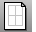

---
---

# Layout toolbar
 [To open a toolbar](javascript:void(0);) Toolbars can be opened as a free-standing group or added to the current group.
To open a toolbar as a free-standing group
Click theOptionsicon in any toolbar group.On the menu, clickShow Toolbar, and then select the toolbar name from the list.To open a toolbar as a new tab in the current group
Click theOptionsicon in the toolbar group where you want to add the new tab.On the menu, clickShow or Hide Tabs, and then select the toolbar name from the list. [CopyLayout](layout.html#copylayout) 
Copy the active layout to a new layout.
 [CopyViewportToDetail](detail.html#copydetailtoviewport) 
Copy or move a model viewport to a detail viewport.
 [Detail, *Add* ](detail.html#add) 
Add a detail viewport.
 [HideInDetail](detail.html#hideindetail) 
Conceal objects in a detail view.
 [ShowInDetail](detail.html#showindetail) 
Redisplay hidden objects in a detail view.
 [HideLayersInDetail](detail.html#hidelayersindetail) 
Conceal layers in a detail view.
 [ShowLayersInDetail](detail.html#showlayersindetail) 
Redisplay hidden layers in a detail view.
 [ImportLayout](layout.html#importlayout) 
Import a print layout viewport from another file.
 [Layout](layout.html) 
Create a print layout viewport.
 [Layout, *1 Detail* ](layout.html) 
Create a print layout viewport.
 [Layout, *4 Details* ](layout.html) 
Create a print layout viewport.
 [LayoutProperties](layout.html#layoutproperties) 
Manage layout viewport properties.
 [ShowSelectedInDetail](detail.html#showselectedindetail) 
Redisplay selected hidden objects in a detail view.
&#160;
&#160;
Rhinoceros 6 © 2010-2015 Robert McNeel &amp; Associates.11-Nov-2015
 [Open topic with navigation](layout-toolbar.html) 

