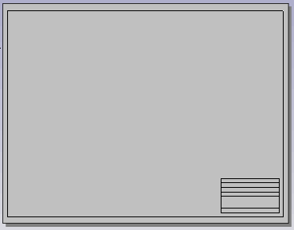
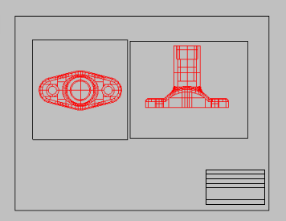
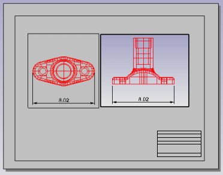
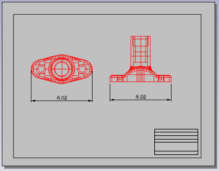

---
---

{: #kanchor458}{: #kanchor459}{: #kanchor460}{: #kanchor461}{: #kanchor462}{: #kanchor463}{: #kanchor464}{: #kanchor465}{: #kanchor466}{: #kanchor467}{: #kanchor468}{: #kanchor469}{: #kanchor470}{: #kanchor471}
# Layout
 [Where can I find this command?](javascript:void(0);) Toolbars
 [Drafting](drafting-toolbar.html) 
Menus
View andLayout Title
Layout
New Layout
The Layout command creates a print layout viewport.
A layout viewport represents the sheet of paper that will be sent to a printer or a file such as PDF. Layouts can include various views of the model and annotations like title blocks and notes.
Two types of viewports provide different functions: *model viewports* and *layout viewports*.
In *model viewports*, create your surface or solid model using the appropriate units and precision.
In *layout viewports*, place one or more details of your model and add information that annotates the printed sheet, such as manufacturing notes, bill of materials, general notes, title blocks, seals, and scale bars.
These viewports are accessible on the tabs at the bottom of the modeling area. The [ViewportTabs](new-viewport-arrangements.html#viewporttabs) command turns the tabs on and off.
Detail viewports
Layout viewports contain [detail viewports](detail.html). Detail viewport contain a view of the model. Details have their own [viewport properties](viewportproperties.html) and [object properties](properties.html). The [color](properties.html#printcolor), [width](properties.html#printwidth), and other properties of the detail viewport edge including the [No Print](properties.html#noprint) property are [object properties](properties.html) of the detail.
New / Modify Layout{: #new-layout}
Name
The layout viewport name.
Select Printer
Printer
Select the target printer from the list of configured printers.
Size
Select a supported paper size from the list.
Portrait/Landscape
Sets the orientation.
Width/Height
Sets the size of the paper as well as the width (x length) and height (y length) of the layout. If the paper size not support by the selected printer, thePrintersetting will be disabled.
&lt;inches&gt;
Units for the paper size.
Initial Detail Count
The number of [details](detail.html) to start with.
Steps
In theNew Layoutdialog box, specify options.Draw a border or [insert](insert.html) a title block onto the layout.Add text that does not relate to the model such as the project name, sheet number, sheet content, and the like.Add [annotation](sak-drafting.html) objects such as [text](text.html) and title blocks.Create [details](detail.html) and arrange them on the layout.In each [detail](detail.html) set up view of the model, orientation, and scale.In the detail viewport, add text and dimensions that apply to the model geometry.To correctly reflect model geometry, add dimensions in the detail viewport. Text added here relates to and reflects the model rather than the layout. For example, if a beam is labeled as M8X6.5, it needs to be in the detail viewport.Set the visibility of the detail edge on the printed page. Use [Properties](properties.html) to access the [Print Width](properties.html#printwidth)  [No Print](properties.html#noprint) property. [Print](print.html).
# Related commands

## ImportLayout
{: #importlayout}
 [Where can I find this command?](javascript:void(0);) Toolbars
 [Layout](layout-toolbar.html) 
Menus
View
Layout
Import
Shortcut
ClickAdd Viewporttab
The ImportLayout command imports one or more layouts from a Rhino file into the current Rhino model.
This allows defining standard title block pages in a single file and importing those pages into other Rhino files.

## CopyLayout
{: #copylayout}
 [Where can I find this command?](javascript:void(0);) Toolbars
 [Not on toolbars.](toolbarwhattodo.html) 
Menus
 [Not on menus.](menuwhattodo.html) 
The CopyLayout command copies the active layout to a new layout.

## LayoutProperties
{: #layoutproperties}
 [Where can I find this command?](javascript:void(0);) Toolbars
 [Layout](layout-toolbar.html) 
Menus
 [Not on menus.](menuwhattodo.html) 
The LayoutProperties command opens the [Modify Layout](#new-layout) dialog box.
See also
 [Use drafting tools](sak-drafting.html) 
&#160;
&#160;
Rhinoceros 6 © 2010-2015 Robert McNeel &amp; Associates.11-Nov-2015
 [Open topic with navigation](layout.html) 

