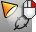

---
---

# Light Tools toolbar
{: #kanchor2344}
 [To open a toolbar](javascript:void(0);) Toolbars can be opened as a free-standing group or added to the current group.
To open a toolbar as a free-standing group
Click theOptionsicon in any toolbar group.On the menu, clickShow Toolbar, and then select the toolbar name from the list.To open a toolbar as a new tab in the current group
Click theOptionsicon in the toolbar group where you want to add the new tab.On the menu, clickShow or Hide Tabs, and then select the toolbar name from the list. [EditLightByLooking](editlightbylooking.html) 
Set a spotlight direction using view manipulation tools.
 [EditLightByLooking, *NewSpotlight* ](editlightbylooking.html) 
Create new light by looking.
 [SetViewToSpotlight](setviewtospotlight.html) 
Match the view to a spotlight direction.
 [SetSpotlightToView](setspotlighttoview.html) 
Match spotlight direction to the viewport camera direction.
 [SetSpotlightToView, *NewSpotlight* ](setspotlighttoview.html) 
Add a spotlight from current view.
&#160;
&#160;
Rhinoceros 6 © 2010-2015 Robert McNeel &amp; Associates.11-Nov-2015
 [Open topic with navigation](light-tools-toolbar.html) 

