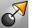
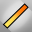
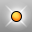
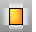

---
---

# Lights toolbar
{: #kanchor2345}
 [To open a toolbar](javascript:void(0);) Toolbars can be opened as a free-standing group or added to the current group.
To open a toolbar as a free-standing group
Click theOptionsicon in any toolbar group.On the menu, clickShow Toolbar, and then select the toolbar name from the list.To open a toolbar as a new tab in the current group
Click theOptionsicon in the toolbar group where you want to add the new tab.On the menu, clickShow or Hide Tabs, and then select the toolbar name from the list. [EditLightByHighlight](editlightbyhighlight.html) 
Add lights based on highlight locations.
 [DirectionalLight](directionallight.html) 
Insert a light with parallel rays pointing in a direction.
 [Light properties](light.html) 
Manage color, on/off, shadow intensity, spotlight hardness.
Link to [Light Tools toolbar](light-tools-toolbar.html) 
 [LinearLight](linearlight.html) 
Insert a tubular light.
 [PointLight](pointlight.html) 
Insert an omni-directional light.
 [RectangularLight](rectangularlight.html) 
Insert a rectangular directional light.
 [Spotlight](spotlight.html) 
Insert a light cone object.
&#160;
&#160;
Rhinoceros 6 © 2010-2015 Robert McNeel &amp; Associates.11-Nov-2015
 [Open topic with navigation](lights-toolbar.html) 

