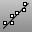

---
---

{: #kanchor1306}
# LineThroughPt
 [Where can I find this command?](javascript:void(0);) Toolbars
 [Lines](lines-toolbar.html) 
Menus
 [Not on menus.](menuwhattodo.html) 
The LineThroughPt command fits a line through selected points.
Steps
 [Select](select-objects.html) any combination of [points](point.html), [control points](controlpoint.html), and [point-cloud](pointcloud.html) objects.Your browser does not support the video tag.See also
 [Draw lines and curves](sak-curve.html) 
&#160;
&#160;
Rhinoceros 6 © 2010-2015 Robert McNeel &amp; Associates.11-Nov-2015
 [Open topic with navigation](linethroughpt.html) 

