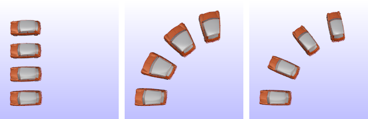

---
---

{: #kanchor1331}
# Maelstrom
 [Where can I find this command?](javascript:void(0);) Toolbars
 [Deformation Tools](deformation-tools-toolbar.html) 
Menus
 [Not on menus.](menuwhattodo.html) 
The Maelstrom command deforms objects in a spiral.
Steps
 [Select](select-objects.html) objects. [Pick](pick-location.html) the center and radius of the maelstrom.See the [Circle](circle.html) command for option descriptions.Pick the second radius.Your browser does not support the video tag.Second radius options
Copy
The Copy option specifies whether or not the objects are copied. A plus signappears at the cursor when copy mode is on.
The [RememberCopyOptions](remembercopyoptions.html) command determines whether the selected option is used as the default.
Rigid
The Rigid option specifies that individual objects will not be deformed as they are transformed.
The illustration shows the Rigid option with the Bend command.

Original objects (left), Rigid=No (center), Rigid=Yes (left).
Yes
Individual objects will not change, only their positions will change.
No
Individual objects are transformed as well as their positions.
Pick the coil angle.See also
 [Use Universal Deformation Technology](sak-udt.html) 
&#160;
&#160;
Rhinoceros 6 © 2010-2015 Robert McNeel &amp; Associates.11-Nov-2015
 [Open topic with navigation](maelstrom.html) 

