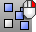
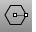
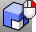
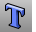
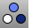

---
---

# Main Sidebar toolbar
{: #kanchor2349}
 [To open a toolbar](javascript:void(0);) Toolbars can be opened as a free-standing group or added to the current group.
To open a toolbar as a free-standing group
Click theOptionsicon in any toolbar group.On the menu, clickShow Toolbar, and then select the toolbar name from the list.To open a toolbar as a new tab in the current group
Click theOptionsicon in the toolbar group where you want to add the new tab.On the menu, clickShow or Hide Tabs, and then select the toolbar name from the list. [Align](align.html) 
Line up bounding boxes of objects.
Link to [Align toolbar](align-toolbar.html) 
 [Arc](arc.html) 
Draw an arc with options for center, start, angle, and direction.
Link to [Arc toolbar](arc-toolbar.html) 
 [Array](array.html) 
Copy and space objects in columns, rows, and levels.
 [Block](block.html) 
Define a block object.
 [BooleanUnion](booleanunion.html) 
Combine the volumes of one or more objects.
Link to [Solid Tools toolbar](solid-tools-toolbar.html) 
 [Box](box.html) 
Draws a solid box.
Link to [Solids Creation toolbar](solid-creation-toolbar.html) 
 [Cancel](cancel.html) 
Cancel the current command and deselects objects.
 [Cancel, *All* ](cancel.html) 
Turns off [Points](pointson.html), [CurvatureGraph](curvaturegraph.html), [EMap](emap.html), [Zebra](zebra.html), [MoveUVN](moveuvn.html), [CurvatureAnalysis](curvatureanalysis.html), and deselects objects.
 [Check](check.html) 
Report errors in an object's data structure.
Link to [Diagnostics toolbar](diagnostics-toolbar.html) 
 [Circle](circle.html) 
Draw a circle from center and radius, diameter, points on the circumference, and circumference length.
Link to [Circle toolbar](circle-toolbar.html) 
 [Copy](copy.html) 
Duplicate objects.
 [Copy, *InPlace* ](copy.html#inplace) 
Duplicate objects in the same location as the original.
 [Curve](curve.html) 
Draw a curve from [control point](controlpoint.html) locations.
Link to [Curve toolbar](curve-toolbar.html) 
 [CurveThroughPt](curvethroughpt.html) 
Fit a curve through point objects.
 [Dir](dir.html) 
Display and edit an object's normal direction.
Link to [Analyze toolbar](analyze-toolbar.html) 
 [Flip](flip.html) 
Reverse the normal direction of a curve, surface, or mesh.
 [EditPtOn](pointson.html#editpton) 
Display points on the curve evaluated at [knot](knot.html) averages.
 [PointsOff](pointson.html#pointsoff) 
Turn off [control](pointson.html), [edit](pointson.html#editpton), and [solid](pointson.html#solidpton) points display.
 [Ellipse](ellipse.html) 
Draw a closed elliptical curve from focus points, center and edges, bounding rectangle, and around a curve.
Link to [Ellipse toolbar](ellipse-toolbar.html) 
 [Explode](explode.html) 
Break objects down into components.
 [ExtractSrf](extractsrf.html) 
Separate or duplicate a polysurface face.
 [Fillet](fillet.html) 
Add an arc between two curves and trims or extends the curves to the arc.
Link to [Curve Tools toolbar](curve-tools-toolbar.html) 
 [FilletSrf](filletsrf.html) 
Create a constant-radius round surface between two surfaces.
Link to [Surface Tools toolbar](surface-tools-toolbar.html) 
 [FlowAlongSrf](flowalongsrf.html) 
Re-align objects from a source surface to a target surface.
Link to [Deformation Tools toolbar](deformation-tools-toolbar.html) 
 [Group](group.html) 
Organize objects into a single component.
Link to [Grouping toolbar](grouping-toolbar.html) 
 [History](history.html) 
Store the connection between a command's input geometry and the result, so that when the input geometry changes, the result updates accordingly.
Link to [History toolbar](history-toolbar.html) 
 [Join](join.html) 
Connect curves, surface edges, or surfaces to form a single object.
 [Mesh](mesh.html) 
Create a mesh from a NURBS surface or polysurface.
Link to [Mesh Tools toolbar](mesh-tools-toolbar.html) 
 [MeshToNURB](meshtonurb.html) 
Duplicate each mesh face with a NURBS surface.
 [Move](move.html) 
Move objects from one location to another.
Link to [Transform toolbar](transform-toolbar.html) 
 [Point](point.html) 
Draw a single point object.
Link to [Point toolbar](point-toolbar.html) 
 [Points](points.html) 
Draw multiple point objects.
 [PointsOn](pointson.html) 
Display curve and surface control points.
Link to [Point Editing toolbar](point-edit-toolbar.html) 
 [PointsOff](pointson.html#pointsoff) 
Turn off [control](pointson.html), [edit](pointson.html#editpton), and [solid](pointson.html#solidpton) points display.
 [Polygon](polygon.html) 
Draw a polygon with a specified number of sides with options for inscribed/circumscribed, by edge, star-shaped, around a curve, and vertical.
Link to [Polygon toolbar](polygon-toolbar.html) 
 [Polyline](polyline.html) 
Draw a multi-segment polyline with options for line and arc segments, tracking line helpers, and close.
Link to [Lines toolbar](lines-toolbar.html) 
 [Lines](lines.html) 
Draw multiple adjoining line segments.
 [Project](project.html) 
Project curves/points toward a construction plane to intersect a surface.
Link to [Curve From Object toolbar](curve-from-object-toolbar.html) 
 [Rectangle](rectangle.html) 
Draw a rectangular closed polyline from with options for starting at the center, three points, vertical, and rounded with arc or conic corners.
Link to [Rectangle toolbar](rectangle-toolbar.html) 
 [Rotate](rotate.html) 
Rotate objects around an axis perpendicular to the construction plane.
 [Rotate3D](rotate3d.html) 
Rotate objects around a 3-D axis.
 [Scale](scale.html) 
Change the size of objects uniformly in the x, y, and z&#160;directions.
Link to [Scale toolbar](scale-toolbar.html) 
 [Scale2D](scale2d.html) 
Change the size of objects uniformly in two directions.
 [Split](split.html) 
Divide objects using other objects as cutters.
 [Split,Isocurve](split.html#isocurve) 
Divide objects using isocurves as cutters.
 [SrfPt](srfpt.html) 
Draw a surface from three or four corner points.
Link to [Surface Creation toolbar](surface-creation-toolbar.html) 
 [TextObject](textobject.html) 
Draw text-shaped curves, surfaces, or polysurfaces based on TrueType fonts.
 [Trim](trim.html) 
Cut and delete selected portions of an object at the intersection with another object.
 [Untrim](trim.html#untrim) 
Remove trim curves from trimmed surfaces.
 [Ungroup](group.html#ungroup) 
Remove the group status from objects.
&#160;
&#160;
Rhinoceros 6 © 2010-2015 Robert McNeel &amp; Associates.11-Nov-2015
 [Open topic with navigation](main-sidebar-toolbar.html) 

