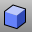

---
---

# Main1 toolbar
{: #kanchor2350}
 [To open a toolbar](javascript:void(0);) Toolbars can be opened as a free-standing group or added to the current group.
To open a toolbar as a free-standing group
Click theOptionsicon in any toolbar group.On the menu, clickShow Toolbar, and then select the toolbar name from the list.To open a toolbar as a new tab in the current group
Click theOptionsicon in the toolbar group where you want to add the new tab.On the menu, clickShow or Hide Tabs, and then select the toolbar name from the list. [Arc](arc.html) 
Draw an arc with options for center, start, angle, and direction.
Link to [Arc toolbar](arc-toolbar.html) 
 [Array](array.html) 
Copy and space objects in columns, rows, and levels.
 [Block](block.html) 
Define a block object.
 [Box](box.html) 
Draws a solid box.
Link to [Solids Sidebar toolbar](solids-sidebar-toolbar.html) 
 [Cancel](cancel.html) 
Cancel the current command and deselects objects.
 [Cancel, *All* ](cancel.html) 
Turns off [Points](pointson.html), [CurvatureGraph](curvaturegraph.html), [EMap](emap.html), [Zebra](zebra.html), [MoveUVN](moveuvn.html), [CurvatureAnalysis](curvatureanalysis.html), and deselects objects.
 [Circle](circle.html) 
Draw a circle from center and radius, diameter, points on the circumference, and circumference length.
Link to [Circle toolbar](circle-toolbar.html) 
 [Copy](copy.html) 
Duplicate objects.
 [Copy,InPlace](copy.html) 
Duplicate objects in the same location as the original.
 [EditPtOn](pointson.html#editpton) 
Display points on the curve evaluated at [knot](knot.html) averages.
 [PointsOff](pointson.html#pointsoff) 
Turn off [control](pointson.html), [edit](pointson.html#editpton), and [solid](pointson.html#solidpton) points display.
 [FlowAlongSrf](flowalongsrf.html) 
Re-align objects from a source surface to a target surface.
Link to [Deformation tools](deformation-tools-toolbar.html) 
 [Group](group.html) 
Organize objects into a single component.
Link to [Grouping toolbar](grouping-toolbar.html) 
 [Join](join.html) 
Connect curves, surface edges, or surfaces to form a single object.
 [Polygon](polygon.html) 
Draw a polygon with a specified number of sides with options for inscribed/circumscribed, by edge, star-shaped, around a curve, and vertical.
Link to [Polygon toolbar](polygon-toolbar.html) 
 [Polyline](polyline.html) 
Draw a multi-segment polyline with options for line and arc segments, tracking line helpers, and close.
Link to [Lines toolbar](lines-toolbar.html) 
 [Lines](lines.html) 
Draw multiple adjoining line segments.
 [Project](project.html) 
Project curves/points toward a construction plane to intersect a surface.
Link to [Curve From Object toolbar](curve-from-object-toolbar.html) 
 [Scale](scale.html) 
Change the size of objects uniformly in the x, y, and z&#160;directions.
Link to [Scale toolbar](scale-toolbar.html) 
 [Scale2D](scale2d.html) 
Change the size of objects uniformly in two directions.
 [SrfPt](srfpt.html) 
Draw a surface from three or four corner points.
Link to [Surface Sidebar toolbar](surface-sidebar-toolbar.html) 
 [TextObject](textobject.html) 
Draw text-shaped curves, surfaces, or polysurfaces based on TrueType fonts.
 [Trim](trim.html) 
Cut and delete selected portions of an object at the intersection with another object.
 [Untrim](trim.html#untrim) 
Remove trim curves from trimmed surfaces.
&#160;
&#160;
Rhinoceros 6 © 2010-2015 Robert McNeel &amp; Associates.11-Nov-2015
 [Open topic with navigation](main1-toolbar.html) 

