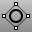
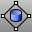
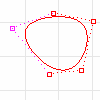
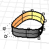
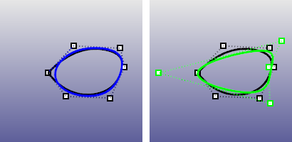
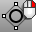
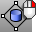
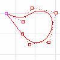
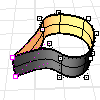

---
---

{: #kanchor1339}{: #kanchor1340}{: #kanchor1341}{: #kanchor1342}{: #kanchor1343}{: #kanchor1344}{: #kanchor1345}{: #kanchor1346}{: #kanchor1347}
# MakePeriodic
 [Where can I find this command?](javascript:void(0);) Toolbars
 [Curve Tools](curve-tools-toolbar.html) 
 [Surface Tools](surface-tools-toolbar.html) 
Menus
Edit
Make Periodic
The MakePeriodic command removes [kinks](kink.html) from a curve or surface.
Periodic curve
A periodic curve is a smooth closed curve. Periodic curves stay smooth when you edit them.

Periodic Surface
Periodic surfaces are closed surfaces (such as a cylindrical surface) that can be deformed without developing [kinks](kink.html). Periodic surfaces are automatically created when the input curves are periodic.

Note
Periodic surfaces and curves deform smoothly without [kinks](kink.html) .If a joined curve is made periodic, it becomes a single-span curve and can no longer explode.Use the [Object Properties, Details](properties.html) to check whether or not a curve is closed and periodic.Steps
 [Select](select-objects.html) the objects.Command-line options
Smooth
Controls [kink](kink.html) removal.
The Smooth option is only available when objects have not been selected.
Yes
Smooths any kinks in the curve and moves [control points](controlpoint.html) to make a smooth curve.
No
 [Control point](controlpoint.html) locations are not changed or changed minimally (only one point may move) and only the [knot vector](knot.html) is altered.

Smooth=Yes (left) and Smooth=No (right.

# MakeNonPeriodic
{: #makenonperiodic}
 [Where can I find this command?](javascript:void(0);) Toolbars
 [Curve Tools](curve-tools-toolbar.html) 
 [Surface Tools](surface-tools-toolbar.html) 
Menus
 [Not on menus.](menuwhattodo.html) 
The MakeNonPeriodic command inserts a kink at the start/end of a curve or surface.
Non-periodic curve
A non-periodic curve is a closed curve with a [kink](kink.html) at the start/end of the curve. Deforming non-periodic curves near the start of the curve may result in kinks.

Non-periodic surface
A non-periodic surface is a closed surface with a [kink](kink.html) at the start/end of the surface. Deforming non-periodic surfaces near the start of the surface may result in kinks. Non-periodic surfaces are automatically created when the input curves are non-periodic.
Non-periodic surfaces and curves deform with sharp corners at [kinks](kink.html).

Steps
 [Select](select-objects.html) the objects.See also
 [Edit curves](sak-curvetools.html) 
&#160;
&#160;
Rhinoceros 6 © 2010-2015 Robert McNeel &amp; Associates.11-Nov-2015
 [Open topic with navigation](makeperiodic.html) 

