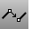

---
---

{: #kanchor1350}{: #kanchor1351}{: #kanchor1352}
# Match
 [Where can I find this command?](javascript:void(0);) Toolbars
 [Curve Tools](curve-tools-toolbar.html) 
Menus
Curve
Curve Edit Tools
Match
The Match command changes a curve end to meet a specified curve or surface edge with a specified continuity.
Steps
 [Select](select-objects.html) the end of an open curve.Select the curve to match.Choose options.Command-line options
SurfaceEdge
Matches the curve perpendicular to the curve and uses the surface to determine continuity.
Match Curve Options
Continuity
Sets the [continuity](continuity-descriptions.html) for the match.
Position
Tangency
Curvature
Your browser does not support the video tag.Preserve other end
Prevents modification of the curvature at the end opposite the match for curves with fewer than six control points.
Your browser does not support the video tag.None
No constraint.
Position
Location only.
Tangency
Position and curve direction.
Curvature
Position, direction, and radius of curvature.
Perpendicular to Edge
Sets the curve perpendicular to a surface edge.
Average curves
Both curves adjust to match each other.
Your browser does not support the video tag.Join
Joins the resulting curves.
Merge
Merge is available with the Curvature option, and it makes a single curve instead of a composite curve. If you edit this curve's [control points](controlpoint.html), the location where the two original curves match will deform smoothly. You cannot explode the curve into the segments that were originally matched.
See also
 [Edit curves](sak-curvetools.html) 
&#160;
&#160;
Rhinoceros 6 © 2010-2015 Robert McNeel &amp; Associates.11-Nov-2015
 [Open topic with navigation](match.html) 

