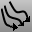

---
---

{: #kanchor1353}
# MatchCrvDir
 [Where can I find this command?](javascript:void(0);) Toolbars
 [Curve Tools](curve-tools-toolbar.html) 
Menus
Curve
Edit Tools
Match Direction
The MatchCrvDir command changes the direction of selected curves to duplicate the direction of a specified curve.
Steps
 [Select](select-objects.html) the curve to match.Select the curves to change.See also
 [Edit curves](sak-curvetools.html) 
&#160;
&#160;
Rhinoceros 6 © 2010-2015 Robert McNeel &amp; Associates.11-Nov-2015
 [Open topic with navigation](matchcrvdir.html) 

