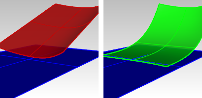

---
---

{: #kanchor1358}{: #kanchor1359}{: #kanchor1360}
# MatchSrf
 [Where can I find this command?](javascript:void(0);) Toolbars
 [Surface Tools](surface-tools-toolbar.html) 
Menus
Surface
Surface Edit Tools
Match
&#160; [Crease splitting enabled](creasesplttingenabled.html) 
 [&#160;History enabled](historyenabled.html) 
The MatchSrf command adjusts the edge of a surface to have position, tangent, or curvature continuity with another surface.
Steps
 [Select](select-objects.html) an untrimmed surface edge.Select a surface edge or curve to match.Pick the two surfaces near same ends. This surface can be either trimmed or untrimmed.
Choose options.Your browser does not support the video tag.Command-line options
MultipleMatches
Allows selection of more than one edge to match.
Your browser does not support the video tag.
CurveNearSurface
When theCurveNearSurfaceoption is on, you can select a curve that is on or near a surface as the target, and then a surface to match to at that curve. The curve is pulled to the surface.

Before match (left); after match (right).
Note
The match is to the surface as if the pulled curve were an edge.There is no good way to determine, absent a trim, which way the match should go, so the dialog has a Flip button to control the direction of the match.You can also press Enter to skip selecting a target curve and only select a target surface.In that case, the edge to be changed is pulled to the target surface and the pulled curve is used as the target.If theMultipleMatchesoption is selected, only matching to an edge is allowed.ChainEdges
Selects surface edges that are touching the selected curve.
How to chain select
Select the first segment.ChainEdges options
AutoChain
Selecting a curve or surface edge automatically selects all curve segments connected with the level of [continuity](continuity-descriptions.html) set by the ChainContinuity option.
ChainContinuity
Controls the level of [continuity](continuity-descriptions.html) required between segments to be selected with theAutoChainoption.
Direction
Forward
Selects curves in the positive curve [direction](dir.html#normaldirection).
Backward
Selects curves in the negative curve [direction](dir.html#normaldirection).
Both
Selects curves in both the positive and negative curve [direction](dir.html#normaldirection).
GapTolerance
If the gap between two edges/curves is less than this value, the chain selection will ignore the gap and will select the next segment.

AngleTolerance
When Continuity is set to Tangency, if the angle between two edges/curves is less than this value, the chain selection will consider the criteria for continuity met and will select the next segment.

Undo
Undo last segment selection.
Next
Select next segment.
All
Select all segments.
Match Surface Options
Continuity
Sets the [continuity](continuity-descriptions.html) for the match.
Your browser does not support the video tag.
Position
Location only.
Tangency
Position and direction.
Curvature
Position, direction, and radius of curvature.
Preserve other end
Changes the surface structure to prevent modification of the curvature at the edge opposite the match.
Your browser does not support the video tag.
None
No constraint.
Position
Location only.
Tangency
Position and curve direction.
Curvature
Position, direction, and radius of curvature.
Average surfaces
Both surfaces are modified to an intermediate shape. If the target surface is also untrimmed, the surfaces match by averaging the two.
Your browser does not support the video tag.Match edges by closest points
Aligns the surface being changed to the target edge in two ways:
Stretches or compresses the surface to match the entire edge end to end, or pulls each point object on the edge to the closest point object on the other edge.
Your browser does not support the video tag.Refine match
Determines if the match results should be tested for accuracy and refined so the faces match within [tolerance](units.html#absolutetolerance). If necessary, Rhino adds [knot](knot.html) lines to the modified surface or surfaces until the surfaces are within [tolerance](units.html#absolutetolerance).
Your browser does not support the video tag.Distance __ units
Position matching in model units.
Tangency __ degrees
Tangency matching.
Curvature __ percent
Curvature matching, in percent of the radius of curvature.
 **Flip** (CurveNearSurfaceOnly)
Changes the direction of the surface.
Isocurve direction adjustment
Specifies the way the [parameterization](parameterization.html) of the matched surfaces is determined.
Your browser does not support the video tag.Automatic
If the target edge is not trimmed, it works like theMatch target isocurve directionoption.
If the target edge is trimmed, it works like theMake perpendicular to the target edgeoption.
Preserve isocurve direction
Does not change the existing [isoparametric curves](isocurve.html) directions.
Match target isocurve direction
The [isoparametric curves](isocurve.html) of the surface will be parallel to those of the target surface.
Make perpendicular to target edge
The [isoparametric curves](isocurve.html) of the surface will be perpendicular to the target surface edge.
Note
The edge of a surface being modified must be an untrimmed edge.A closed edge cannot be matched to an open edge.Only single complete edge curves can be matched. If you need to match to part of an edge, trim the surface or split the edge (using the [SplitEdge](splitedge.html) command).MatchSrf is the most reliable when the surfaces are nearly matched already and require only a small amount of movement to get an accurate match.MatchSrf can be useful for matches that are more similar to geometry creation than to fine-tuning. It is possible to move edges a long way and change their shape drastically, but it might take some experimenting to get what you want.You can sometimes change the results of MatchSrf by adding or removing knots manually before you do the match using the [InsertKnot](insertknot.html) and [RemoveKnot](insertknot.html#removeknot) commands.See also
 [Edit surfaces](sak-surfacetools.html) 
&#160;
&#160;
Rhinoceros 6 © 2010-2015 Robert McNeel &amp; Associates.11-Nov-2015
 [Open topic with navigation](matchsrf.html) 

