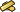

---
---

# Material
{: #kanchor2810}
{: #kanchor2809}
{: #kanchor2808}
{: #kanchor2807}
 [Where can I find this command?](javascript:void(0);) Toolbars
 [Popup](popup-toolbar.html)  [Properties](properties-toolbar.html)  [Standard](standard-toolbar.html) 
Menus
Edit and Panels
Object Properties
Shortcut
F3
TheMaterialproperties manage render material settings for the selected objects.
Material
Assign material by
Rendering properties can be assigned to layers, or to objects that will be used with the basic Rhino renderer.
{: #assignbylayer}Layer
The object inherits the render material assigned to the layer. To change the material assignment of the layer, use the [Layers](layer.html) dialog box.
Parent
The object inherits the render material from its parent object.
Example using Parent material
Set the material for Layer 1.Draw a Sphere on Layer 1.Select the sphere, and set its material property toParent.Use the [Block](block.html) command to turn the sphere into a block.Set the material for Layer 2 to a different material.Insert the block from step 4 on Layer 2.The sphere will display the material assigned to Layer 2 because the block instance is on Layer&#160;2, and the objects in the block are assigned their materialBy Parent.Select the block instance, and set its material property to object.The sphere will change to the object material.For nested blocks: Blocks made of nested blocks that include objects set to the Parent material are not affected by further nesting.
{: #assignbyobject}Object
Render materials are assigned to individual objects and are used by Rhino's built-in renderer.
See: [MaterialEditor](materialeditor.html).
Plug-in
Render materials are assigned using the current rendering plug-in application.
This option appears only if there is a rendering plug-in loaded.
Import from File
Imports materials from a saved Rhino .rmtl file.
Use a new material
Creates a new material. Choose a [material type](#type) to use as a template.
Import from material library
Imports materials from a saved Rhino .rmtl file.
 [Custom](materialeditor.html#basic-settings) 
 [Gem](materialeditor.html#gem-panel) 
 [Glass](materialeditor.html#glass-panel) 
 [Metal](materialeditor.html#metal-panel) 
 [Paint](materialeditor.html#paint-panel) 
 [Picture](materialeditor.html#picture-panel) 
 [Plaster](materialeditor.html#plaster-panel) 
 [Plastic](materialeditor.html#plastic-panel) 
Edit
This option is only available when the material assigned is from a render plug-in.
Duplicate
Copies the material to a new material.
{: #name}Name
Names the texture. All textures are automatically assigned a name. You can change this generic name.
When a texture or image file is dragged to a Rhino object, a material with that image is assigned to the object.
{: #type}Type
Sets the material type.
Note
At any time, you can change the material to a different type using this control.Changing a material type maintains all of the settings the material types share. For example, changing a gold metal material to a paint material maintains the gold diffuse color. Changing the gold to a gem matches the gem color and becomes Amber. [Custom](materialeditor.html#basic-settings) 
 [Gem](materialeditor.html#gem-panel) 
 [Glass](materialeditor.html#glass-panel) 
 [Metal](materialeditor.html#metal-panel) 
 [Paint](materialeditor.html#paint-panel) 
 [Picture](materialeditor.html#picture-panel) 
 [Plaster](materialeditor.html#plaster-panel) 
 [Plastic](materialeditor.html#plastic-panel) 
Settings
The settings displayed in this panel depend on the [material type](#type).
 [Custom](materialeditor.html#basic-settings) 
 [Gem](materialeditor.html#gem-panel) 
 [Glass](materialeditor.html#glass-panel) 
 [Metal](materialeditor.html#metal-panel) 
 [Paint](materialeditor.html#paint-panel) 
 [Picture](materialeditor.html#picture-panel) 
 [Plaster](materialeditor.html#plaster-panel) 
 [Plastic](materialeditor.html#plastic-panel) 
Custom Settings
The default material is white and matte, with no reflectivity or transparency.
{: #color}Color
Sets the material's base (also called *diffuse* ) [color](materialeditor.html#color-diffuse).
{: #gloss-finish}Gloss finish
Adjusts the highlight ( [gloss finish](materialeditor.html#glossfinish) ) from matte to glossy.
Reflectivity
Sets the material's [reflectivity](materialeditor.html#reflectivity).
Trans.
Adjusts the [transparency](materialeditor.html#transparency) of an object in the [rendered](render.html) image.
IOR
Sets the level of transparency based on the [index of refraction](materialeditor.html#ior) scale.
Textures
Textures (bitmap images or procedural textures) can be used for color, transparency, bump, and environment.
Note
Images changed outside of Rhino in Photoshop or a similar program automatically update in the rendered view.Materials in the material library use texture stored on the internet the first time they are used.Image textures
To specify an image
Click in the(empty - click to assign)slot.Select an image file to use.In the edit box, specify the percentage of strength the image will use to affect the color, transparency, bump, or environment.Color
Specifies a texture to use as the material's [color](materialeditor.html#texturecolor).
Transparency
Sets a texture to use as the material's [transparency](materialeditor.html#texturetransparency).
Bump
Defines the name of a bitmap file that will be mapped on the surface as a [bump map](materialeditor.html#texturebump) when you render the scene.
A bitmap image makes a surface appear bumpy in a rendered image but does not modify the shape of the surface.
Environment
Sets a texture to use as the material's [environment](materialeditor.html#textureenvironment). This will be mapped onto the surface as though it were being reflected.
Advanced Settings
 [Emission color](materialeditor.html#emission-color) 
 [Ambient color](materialeditor.html#ambient-color) 
 [Enable diffuse lighting](materialeditor.html#enable-diffuse-lighting) 
Notes
Add notes to provide extra information. The notes are saved with the document.
 **Match** 
Changes the material properties to match a different object.
Command-line options
To access command-line options
Type a hyphen in front of the command name:-Properties.SelectMaterialor typem.Assign
Rename
Library
Color
GlossColor
GlossFinish
Transparency
TextureMap
TransparencyMap
BumpMap
EnvironmentMap
Match{: #kanchor2811}
See also
 [Render](render.html) 
Render the objects using the current renderer.
 [MaterialEditor](materialeditor.html) 
Open the Material Editor to manage materials in the model.
 [Use materials and textures](sak-materialsandtextures.html) 
 [Manage object properties](sak-objectproperties.html) 
&#160;
&#160;
Rhinoceros 6 © 2010-2015 Robert McNeel &amp; Associates.11-Nov-2015
 [Open topic with navigation](material.html) 

