---
---

{: #kanchor1361}{: #kanchor1362}{: #kanchor1363}{: #kanchor1364}{: #kanchor1365}{: #kanchor1366}{: #kanchor1367}{: #kanchor1368}{: #kanchor1369}{: #kanchor1370}{: #kanchor1371}{: #kanchor1372}{: #kanchor1373}{: #kanchor1374}{: #kanchor1375}{: #kanchor1376}{: #kanchor1377}{: #kanchor1378}{: #kanchor1379}{: #kanchor1380}{: #kanchor1381}{: #kanchor1382}{: #kanchor1383}{: #kanchor1384}{: #kanchor1385}{: #kanchor1386}{: #kanchor1387}{: #kanchor1388}
# MaterialEditor
 [Where can I find this command?](javascript:void(0);) Toolbars
 [Render Tools](render-tools-toolbar.html) 
Menus
PanelsandRender
Material Editor
The MaterialEditor command opens the Materials panel which specifies the color, finish, transparency, texture, and bump for use by the built-in Rhino renderer.
Note
Materials can be dragged and dropped onto any Material, [Texture](texturepalette.html), and [Environment](environmenteditor.html) control.Any number of materials can be stored in the model. Materials can be designed in-place in the material and environment editors by adding textures as child. Opening a floating preview allows visualization of the texture during its development.Colors and textures can be dragged from the color swatch and dropped onto any other color swatch or control in the Material Editor, [Texture Palette](texturepalette.html), or [Environment Editor](environmenteditor.html) .Material Editor Panel
Materials panel toolbar
 [Panel options](panel-options.html) 
The Materials panel has additional browsing tools.
Back
Walks back though the previously selected materials.
Forward
Walks forward through the previously selected materials.
Currently selected item name
Displays the current material icon and name.
Search
Search for materials.
Menu
Displays the [Tools](materialpanel-toolsmenu.html) menu.
Help
Thumbnail preview actions
Right-click a thumbnail to display a [context menu](materialthumbnail-contextmenu.html) .Right-click the blank area of the thumbnail browser to display a [context menu](materialthumbnail-blankcontextmenu.html) .Right-click and drag in the thumbnail to change the view.Double-click to display a larger preview window.Drag the preview thumbnails to reorder the list.Double-click the large preview to open a floating window that can be re-sized to get a higher resolution view of the preview.This window has all the same functionality as the original preview image including the context menu and the ability to drag and drop onto other materials or objects in the model.Right-click the large preview window or the floating preview window to display the [context menu](materialpanel-largepreviewmenu.html).
## Assign materials to objects
To assign a material to objects
On the [Tools](materialpanel-toolsmenu.html) menu, clickAssign to Selection.In the Rhino viewport, select the target objects.Materials can be assigned to polysurface faces using [sub-object section](selection-commands.html#sub-object-selection) .To pre-select objects
In the Rhino viewport, select the target objects.On the [Tools](materialpanel-toolsmenu.html) menu, clickAssign to Selection.To drag and drop materials to objects
Drag the material from the thumbnails or list onto the target objects.
## Assign materials to layers
To assign a material to layers from the Material Editor
On the [Tools](materialpanel-toolsmenu.html) menu, clickAssign to Layers.In theChoose Layersdialog box, check the boxes for the material assignment.To assign materials to layers of selected objects
On the [Tools](materialpanel-toolsmenu.html) menu, clickAssign to Layers of Selected objects.In the Rhino viewport, select the target objects.To assign materials from the Layers panel
In the [Layer](layer.html) panel, select one or more layers and click the [Material](layer.html#material) column.In theLayer Materialdialog box, select the material to assign.To drag and drop materials to layers
Drag the material from the thumbnails or list onto a target layer in the [Layer](layer.html) panel.Drag and drop works for only one layer at a time.
## Creating and editing materials
To create a new material
In the thumbnail browser, click theCreate New Materialbutton.On the menu, select a material type.Create New Material&#160;
Import from material library
Imports materials from a saved Rhino .rmtl file.
Custom
Creates a new [custom](#basic-settings) material.
Basic materials have all possible [settings](#basic-settings) available in the editor.
Gem
Creates a new [gem](#gem-panel) material.
Glass
Creates a new [glass](#glass-panel) material.
Metal
Creates a new [metal](#metal-panel) material.
Paint
Creates a new [paint](#paint-panel) material.
Picture
Creates a new [picture](#picture-panel) material.
Plaster
Creates a new [plaster](#plaster-panel) material.
Plastic
Creates a new [plastic](#plastic-panel) material.
{: #name}Name
Names the texture. All textures are automatically assigned a name. You can change this generic name.
When a texture or image file is dragged to a Rhino object, a material with that image is assigned to the object.
{: #type}Type
Sets the material type.
Note
At any time, you can change the material to a different type using this control.Changing a material type maintains all of the settings the material types share. For example, changing a gold metal material to a paint material maintains the gold diffuse color. Changing the gold to a gem matches the gem color and becomes Amber. [Custom](#basic-settings) 
 [Gem](#gem-panel) 
 [Glass](#glass-panel) 
 [Metal](#metal-panel) 
 [Paint](#paint-panel) 
 [Picture](#picture-panel) 
 [Plaster](#plaster-panel) 
 [Plastic](#plastic-panel) 
Custom Settings
The default material is white and matte, with no reflectivity or transparency.
{: #color-diffuse}Color
TheColorcontrol sets the material's base (also called *diffuse* ) color.
The color used to [render](render.html) surfaces, polysurfaces, or polygon meshes.
The color option does not affect the select wireframe display. To change the color of the wireframe display, change the color of the object's [layer](layer.html) or set the color in [Object Properties.](properties.html) 
You can drag the color swatch to a folder to create a Rhino color file.
To add this color to a color library
Drag it from a folder to another color swatch in the [Material](#), [Environment](environmenteditor.html), or [Texture Palette](texturepalette.html) panels, or you can drag it onto an object.To change the color
Click the color swatch to select a color from the [Select Color](select-color.html) dialog box.Click the menu arrow or [right-click](right-mouse-click.html) the swatch to open the context menu.Menu options
Color Picker
Opens the [Select Color](select-color.html) dialog box.
Eye Dropper
Allows picking the color from anywhere on the screen.
Copy
Copies the color in the color swatch.
Paste
Pastes the color from one color swatch to another.
In the edit box, specify the percentage of strength the color.{: #glossfinish}Gloss finish
TheGloss finishcontrol adjusts the highlight from matte to glossy and sets the color of the glossy area.
To change the glossiness
Move the slider to the right to increase the glossiness.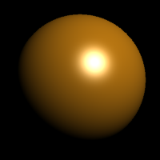To set the gloss finish color
Select the gloss finish color using the color swatch.Set the highlight color to match the base color for metallic materials. Set the gloss color to white for plastic materials.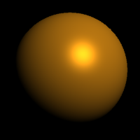Reflectivity{: #reflectivity}
TheReflectivitysetting sets the material's reflectivity amount and sets the reflective color.
To change the reflectivity amount
Move the slider to the right to increase the reflectivity.To change the reflectivity color
Select the reflectivity color using the color swatch.Transparency{: #transparency}
Adjusts the transparency of an object in the [rendered](render.html) image.
To set the transparency value
Move the slider to the right to increase the transparency.{: #ior}IOR (Index of Refraction)
Sets the level of transparency based on the index of refraction (IOR) scale.
Example IOR values are shown in the following table:
MaterialIORVacuum1.0Air1.00029Ice1.309Water1.33Glass1.52 to 1.8Emerald1.57Ruby/Sapphire1.77Diamond2.417{: #transparency-color}To change the transparency color
Select the transparency color using the color swatch.Textures
Textures (images or procedural textures) can be used for color, transparency, bump, and environment.
Note
Images changed outside of Rhino in Photoshop or a similar program automatically update in the rendered view.Materials in the material library use textures stored on the internet the first time they are used.{: #image}
Note
Rhino supports the following file formats:
Transparency isnotsupported in these formats:
JPEG - JFIF Compliant (*.jpg, *.jpeg, *.jpe){: #kanchor1389}{: #kanchor1390}Windows Bitmap (*.bmp)Transparencyissupported in these formats:
{: #kanchor1391}{: #kanchor1392}DDS files (*.dds){: #kanchor1393}{: #kanchor1394}HDRi files (*.hdr, *. hdri){: #kanchor1395}{: #kanchor1396}OpenEXR files (*.exr){: #kanchor1397}{: #kanchor1398}Portable Network Graphics (*.png){: #kanchor1399}{: #kanchor1400}Tagged Image File Format (*.tif, *.tiff){: #kanchor1401}{: #kanchor1402}Truevision Targa (*.tga)To specify an image
Click the texture control.(click to assign texture)The check box automatically becomes checked the first time you do this. You can clear the check box to turn off the assignment.Select an image file to use.In the edit box, specify the percentage of strength the image will use to affect the color, transparency, bump, or environment.Color{: #texturecolor}
Specifies a texture to use as the material's color.
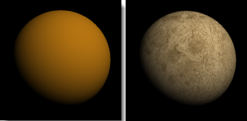
Transparency{: #texturetransparency}
Sets a texture to use as the material's transparency.
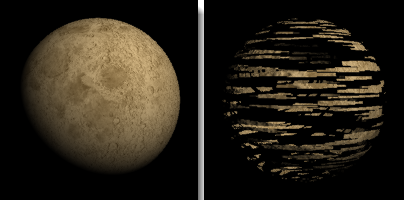
Bump{: #bump}{: #texturebump}
Sets a texture to use as the material's bump.
Defines the name of an image file that will be mapped on the surface as a bump map when you render the scene.
An image makes a surface appear bumpy in a rendered image but does not modify the shape of the surface.
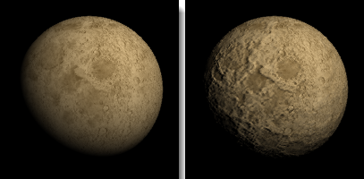
Environment{: #textureenvironment}
Sets a texture to use as the material's environment. This will be mapped onto the surface as though it were being reflected.
The image should be an *angular map* or *light probe* projection (spherical) image. Other image projections will produce the reflection effect, but it will be distorted and not produce the realistic environment reflection.
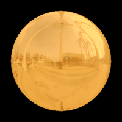
Advanced Settings
{: #enable-diffuse-lighting}Self-illumination
TheSelf-illuminationsetting allows the material to render the diffuse color with shadowing and shading by enabling diffuse lighting.
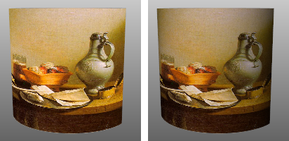
Diffuse lighting off (left) and on (right).
On
If this setting is on, the object renders with shadowing and shading.
Off
If this setting is off, the object will render the diffuse color all over with no shadowing or shading. Turning this setting off ensures that the color the texture of picture frames remains constant over the surface.
{: #fresnel-reflectivity}Fresnel reflectivity
TheFresnel reflectivitysetting causes objects to reflect fully at glancing angles and only slightly reflect when the object is seen head on.
This effect simulates many transparent or semi-transparent materials, such as glass, plastic, and materials that have a thin transparent glaze, such as laminated paper, polished woods, and paint.
{: #alpha-transparency}Alpha transparency
TheAlpha transparencysetting allows images with an alpha channel for transparency to make the object transparent in the areas of the image where the alpha channel is applied.
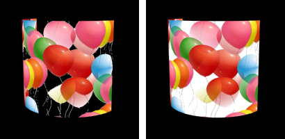
Alpha transparency on (left) and off (right).
{: #reflection-polish}Refl. polish
TheReflection polishsetting makes reflections fuzzy. For surfaces that are perfectly reflective, such as mirrors and chrome, use 100% polish. Lower values model materials like certain plastics and the sanded surface of frosted glass.
Changing this setting can increase rendering time.
{: #transparency-frost}Transp. frost
TheTransparency frostsetting makes transparency fuzzy. For surfaces that have perfect refraction such as water, float glass, and diamonds, use 0% frost. Higher frost values model transparent materials like tracing paper or hand-made glass.
Changing this setting can increase rendering time.
{: #emission-color}Emission color
TheEmission colorsetting adds a color to the shaded result. It does not take into account the lighting, so if the emission color is white, the object will always appear white. If the emission color is gray, all parts of the object will appear brighter than they would otherwise.
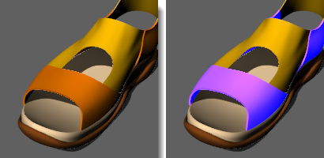
Orange material emission color black (left); emission color blue (right).
Notes
Add notes to provide extra information. The notes are saved with the model and appear as tooltips in theLibrary,Material,Environment, andTexturepanels when you mouse-over the thumbnails.
{: #gem-panel}Gems
The preset Gem materials offer a choice of preset gems. Other settings are pre-determined by the gem type.
Type
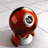
Amber

Amethyst
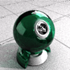
Aquamarine

Diamond

Emerald
Ruby

Sapphire
&#160;
&#160;{: #glass-panel}Glass
The preset Glass material type allows the [Color](#color-diffuse), [Frost](#transparency-frost), and [index of refraction](#ior) settings to be modified. Other settings are pre-determined.
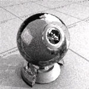
Glass
Color
Sets the diffuse [color](#color-diffuse).
Frost
Sets the [Transparency frost](#transparency-frost).
IOR
Sets the [index of refraction](#ior).
{: #metal-panel}Metal
The preset Metal material allows the [Color](#color-diffuse) and [Polish](#reflection-polish) to be modified.
Other settings are pre-determined by the metal type.

Brass
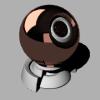
Bronze

Chrome

Copper

Gold

Gold (Yellow)

Platinum

Silver

Stainless steel

Steel

Titanium
Color
Sets the diffuse [color](#color-diffuse).
Common metal colors are presented in the limited palette.
Polish
Sets the [Reflection polish](#reflection-polish).
{: #paint-panel}Paint
The preset Paint material allows the [Color](#color-diffuse) and [Glossiness](#glossfinish) to be modified.
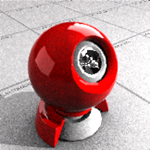
Red paint
Color
Sets the diffuse [color](#color-diffuse).
Glossiness
Sets the [Fresnel reflectivity](#fresnel-reflectivity) and [Reflection polish](#reflection-polish).
{: #picture-panel}Picture
The preset Picture materials place a single image on an object using [surface mapping](texturemapping.html#surface-mapping).
ThePicturematerial allows the [image file](#image), the [Self-illumination](#enable-diffuse-lighting), [Alpha transparency](#alpha-transparency), Greyscale, [Transparency](#transparency), and [Transparent color](#transparency-color) settings to be modified.
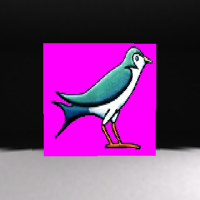
Texture
File
Sets the [image file](#image) to be used.
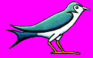
Self-illuminated
Turns [self-illumination](#enable-diffuse-lighting) on.
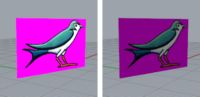
Self-illuminated on (left) and off (right).
Greyscale
Sets the image to greyscale.
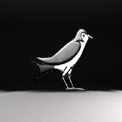
Transparency
Sets the transparency of the image.
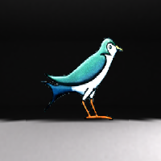
Use alpha channel
Uses the alpha channel in the image to set the transparency.
Use color mask
Uses a specific color in the image to set the transparency.
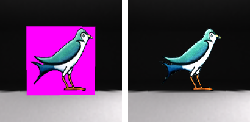
Color mask transparency off (left) and on (right).
Object transparency
The transparency in the image also makes the object to which the material is applied transparent in the areas covered by the color or alpha channel transparency.
{: #plaster-panel}Plaster
The preset Plaster material is the default matte, non-reflective, untextured material. Only the [Color](#color-diffuse) can be changed.
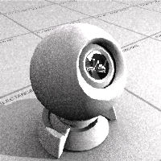
Color
Sets the diffuse [color](#color-diffuse).
{: #plastic-panel}Plastic
The preset Plastic material allows the [Color](#color-diffuse), [Reflectivity](#reflectivity), [Polish](#reflection-polish), [Transparency](#transparency), and [Frost](#transparency-frost) to be changed.
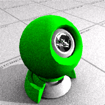
Color
Sets the diffuse [Color](#color-diffuse).
Reflectivity
Sets the [Reflectivity](#reflectivity).
Polish
Sets the [Reflection polish](#reflection-polish).
Transparency
Sets the [Transparency](#transparency).
Frost
Sets the [Transparency frost.](#transparency-frost) 

## Saving render content
Materials, environments, and textures are stored in the model, but render content can also be saved to files that can be shared between models. Content can be dragged between Rhino sessions and into a folder.
Color swatches can be dragged and dropped in the same way.
The [Libraries](libraries.html#libraries) panel displays the default content folder. Use this to drag and drop content into the model or to drag and drop model content to an external file.
Command-line options
To access hidden command-line options
Type ahyphenin front of the command name:-MaterialEditor.ShowPanel=Yes / No / Toggle
Displays the Material Editor panel.
Options
Displays command-line options.
Add
Delete
Rename
Change
Duplicate
LoadFromFile
SaveToFile
AssignToObjects
See also
 [Use materials and textures](sak-materialsandtextures.html) 
 [Render your model scene](sak-render.html) 
&#160;
&#160;
Rhinoceros 6 © 2010-2015 Robert McNeel &amp; Associates.11-Nov-2015
 [Open topic with navigation](materialeditor.html) 

