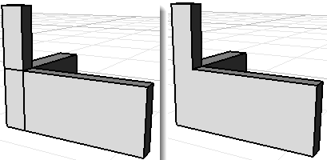

---
---

{: #kanchor1413}
# MergeAllFaces
 [Where can I find this command?](javascript:void(0);) Toolbars
 [Solid Tools](solid-tools-toolbar.html)  [Solid Editing](solid-editing-toolbar.html) 
Menus
Solid
Solid Edit Tools
Faces
Merge All Faces
The MergeAllFaces command combines all co-planar polysurface faces that share at least one edge into one surface.

Steps
 [Select](select-objects.html) a polysurface.See also
 [Edit solid objects](sak-solidtools.html) 
&#160;
&#160;
Rhinoceros 6 © 2010-2015 Robert McNeel &amp; Associates.11-Nov-2015
 [Open topic with navigation](mergeallfaces.html) 

