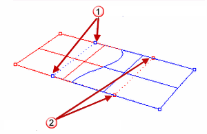
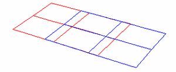

---
---

{: #kanchor1418}{: #kanchor1419}{: #kanchor1420}
# MergeSrf
 [Where can I find this command?](javascript:void(0);) Toolbars
 [Surface Tools](surface-tools-toolbar.html) 
Menus
Surface
Surface Edit Tools
Merge
The MergeSrf command combines two surfaces into one surface at untrimmed edges.
Steps
 [Select](select-objects.html) two surfaces.Both surfaces must be untrimmed and share an edge.Your browser does not support the video tag.Command-line options
{: #smooth}Smooth
The resulting surface will be smooth. This makes the surface behave better for [control point](controlpoint.html) editing, but may alter the shape of both surfaces.
Tolerance
Surface edges must be within this tolerance for the two surfaces to merge.
The Tolerance setting defaults to the Rhino global absolute tolerance. Zero or a value less than the absolute tolerance is not acceptable.
Roundness
Defines the roundness (smoothness, dullness, bluntness, non-sharpness) of the merge. The default is 1 (full smoothing). Acceptable values are between 0 (sharp) and 1 (smooth).
Your browser does not support the video tag.Note
Untrimmed surfaces that share an edge can merge into a single surface. The seam where the two surfaces meet smooths out, which is useful for modeling half of an object, mirroring it, and then merging the surfaces together to eliminate the [kink](kink.html). You can edit the resulting surface.Surfaces can merge only if the shared edge on both surfaces run exactly along [u or v&#160;direction](curvesurfacedirection.html) and the surfaces share both edge endpoints.If the merged surface is closed, use the [MakePeriodic](makeperiodic.html) command to make an even smoother, editable surface.Generally, you can only use the MergeSrf command when you have created untrimmed surfaces by lofting or sweeping and the surfaces share adjacent edges. Use the MergeSrf command to make them into a single surface. Once you have trimmed surfaces, however, you have to approach things differently.A trimmed surface has an underlying untrimmed surface that defines the geometry of the shape. Trimming curves tell Rhino that some parts of the surface are supposed to be holes or are supposed to be cut out. It is the underlying surface that controls the geometry, and that is what the MergeSrf command needs to join surfaces to make one large surface out of smaller surfaces.When you turn on the [control points](controlpoint.html) for two trimmed surfaces, you will see that even though the surfaces can touch up to one another nicely at their trims, their control points do not line up.(1) Control points for blue surface; (2) control points for red surface.
If the [control points](controlpoint.html) do not line up on two trimmed surfaces, the surfaces cannot merge, as control points merge together to make a single surface out of two individual surfaces.If you use [Untrim](trim.html#untrim) on the two trimmed surfaces that you want to merge, this process will become more clear. You'll see that even though the trimming edges of the two surfaces connect, their underlying surfaces do not line up with one another.The MergeSrf command will not smooth non-fully multiple interior knots.See also
 [Edit surfaces](sak-surfacetools.html) 
&#160;
&#160;
Rhinoceros 6 © 2010-2015 Robert McNeel &amp; Associates.11-Nov-2015
 [Open topic with navigation](mergesrf.html) 

