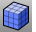

---
---

# Mesh Creation toolbar
{: #kanchor2354}
 [To open a toolbar](javascript:void(0);) Toolbars can be opened as a free-standing group or added to the current group.
To open a toolbar as a free-standing group
Click theOptionsicon in any toolbar group.On the menu, clickShow Toolbar, and then select the toolbar name from the list.To open a toolbar as a new tab in the current group
Click theOptionsicon in the toolbar group where you want to add the new tab.On the menu, clickShow or Hide Tabs, and then select the toolbar name from the list. [3DFace](3dface.html) 
Draw a single mesh face.
 [ExtractControlPolygon](extractcontrolpolygon.html) 
Fit a polyline through curve control points or a mesh through surface control points.
 [Mesh](mesh.html) 
Create a mesh from a NURBS surface or polysurface.
 [MeshBox](meshbox.html) 
Draw a mesh box.
 [MeshCone](meshcone.html) 
Draw a mesh cone.
 [MeshCylinder](meshcylinder.html) 
Draw a mesh cylinder.
 [MeshEllipsoid](meshellipsoid.html) 
Draw a mesh ellipsoid.
 [MeshPatch](meshpatch.html) 
Create a mesh from curves and points.
 [MeshPlane](meshplane.html) 
Draw a rectangular mesh plane.
 [MeshPolyline](meshpolyline.html) 
Create a mesh from a closed polyline.
 [MeshSphere](meshsphere.html) 
Draw a mesh sphere.
 [MeshTorus](meshtorus.html) 
Draw a mesh torus.
&#160;
&#160;
Rhinoceros 6 © 2010-2015 Robert McNeel &amp; Associates.11-Nov-2015
 [Open topic with navigation](mesh-creation-toolbar.html) 

