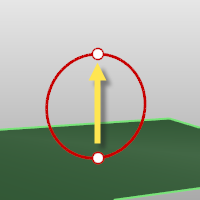
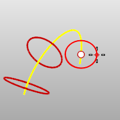

---
---

{: #kanchor1439}{: #kanchor1440}{: #kanchor1441}{: #kanchor1442}
# MeshCylinder
 [Where can I find this command?](javascript:void(0);) Toolbars
 [Mesh Creation](mesh-creation-toolbar.html) 
Menus
Mesh
Polygon Mesh Primitives
Cylinder
The MeshCylinder command draws a polygon mesh cylinder.
Steps
 [Pick](pick-location.html) the center and radius of the base circle.See the [Circle](circle.html) command for option descriptions. [Pick](pick-location.html) the end of the cylinder.Your browser does not support the video tag.Command-line options
Direction constraint options
Direction constraints restrict the direction of the circle.
None
The center can be anywhere in 3-D space.
 [Pick](pick-location.html) the second point anywhere using [elevator mode](cursor-constraints.html#elevator-mode), [object snaps](object-snaps.html) or other [modeling aids](modeling-aids.html) .Vertical
Draws an object perpendicular to the construction plane.
 [Pick](pick-location.html) the center and a radius or diameter.AroundCurve
Draws a circle perpendicular to a curve.
 [Select](select-objects.html) a curve and [pick](pick-location.html) the center of the circle on the curve and aRadiusorDiameter.Solid
The Solid option fills the base with a surface to form a closed solid.
AroundFaces / VerticalFaces

AroundFaces (1)
The number of faces around the circumference.
VerticalFaces (2)
The number of faces from the base to the apex.
See also
 [Cylinder](cylinder.html) 
Draw a cylinder.
 [Mesh](mesh.html) 
Create a mesh from a NURBS surface or polysurface.
&#160;
&#160;
Rhinoceros 6 © 2010-2015 Robert McNeel &amp; Associates.11-Nov-2015
 [Open topic with navigation](meshcylinder.html) 

