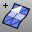

---
---

{: #kanchor1451}{: #kanchor1452}{: #kanchor1453}
# MeshPatch
 [Where can I find this command?](javascript:void(0);) Toolbars
 [Mesh Creation](mesh-creation-toolbar.html) 
Menus
 [Not on menus.](menuwhattodo.html) 
The MeshPatch command creates a polygon mesh from curves and points.
Steps
 [Select](select-objects.html) curves and points.Select closed interior curves to be used to create holes in the mesh, or press [Enter](enter-key.html) to create a mesh with no holes.Closed curves used as the inner boundary are treated as holes.Your browser does not support the video tag.Command-line options
AngleTolerance
Used to make polyline approximations of curves. If only polylines are selected, this setting has no effect on the final output.
StartingSurface
Use a reference surface that is similar in shape to the mesh you are trying to create. The surface will influence the mesh shape.
See also
 [FillMeshHole](fillmeshhole.html) 
Fill a hole in a mesh.
 [FillMeshHoles](fillmeshholes.html) 
Fill all holes in a mesh.
 [Mesh](mesh.html) 
Create a mesh from a NURBS surface or polysurface.
 [Patch](patch.html) 
Fit a surface through curves and point objects.
 [PatchSingleFace](patchsingleface.html) 
Fill a mesh hole with a single mesh face.
&#160;
&#160;
Rhinoceros 6 © 2010-2015 Robert McNeel &amp; Associates.11-Nov-2015
 [Open topic with navigation](meshpatch.html) 

