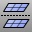

---
---

{: #kanchor1459}{: #kanchor1460}{: #kanchor1461}
# MeshRepair
 [Where can I find this command?](javascript:void(0);) Toolbars
 [Mesh Tools](mesh-tools-toolbar.html) 
Menus
Panels
Mesh Repair
The MeshRepair command opens the Mesh Repair panel.
The Mesh Repair panel contains mesh information display and repair commands to make repairing bad meshes easier
Note
Some STL/SLA printers have problems if meshes contain many long, thin facets. These can slow the printer's slicing process down, produce odd printed results, and run the printer out of memory.The [MeshRepair](#) command may be useful when tuning up meshes for STL/SLA printing.Steps
 [Select](select-objects.html) a mesh and click **Check Mesh** .Information about the mesh is displayed, including the [Edge Analysis](showedges.html) control.Select problems to fix, and clickRepair.When all possible problems have been repaired, click **Next** .Use theAdvanced Repair Toolsto edit the mesh, and then clickFinish.Mesh Repair Panel
 [Panel options](panel-options.html) 
Repair Mesh Options
Degenerate faces
Removes zero-length edges.
Removes duplicate faces.
Inconsistent normals
Reverses inconsistent normals.
Fill Small Gaps options
Distance ___
Min ___ / Max ___
Specifies the range to see in a graph how many small holes will be filled.
Delete Faces
Runs the command.
Patch Face
Runs the command.
Fill Hole
Runs the command.
Fill All Holes
Runs the [FillMeshHoles](fillmeshholes.html) command.
Runs the [SplitMeshEdge](splitmeshedge.html) command.
Swap Edge
Rebuild Mesh
Runs the command.
Unify Mesh Normals
Runs the command for any selected repair.
Runs the [Undo](undo.html) command.
See also
 [DeleteMeshFaces](deletemeshfaces.html) 
Remove mesh faces from a mesh creating a hole.
 [ExtractNonManifoldMeshEdges](extractmeshedges.html#extractnonmanifoldmeshedges) 
Separate non-manifold faces from a mesh.
 [FillMeshHoles](fillmeshholes.html) 
Fill all holes in a mesh.
 [PatchSingleFace](patchsingleface.html) 
Fill a mesh hole with a single mesh face.
 [RebuildMeshNormals](rebuildmeshnormals.html) 
Remove mesh normals and reconstruct the face and [vertex](meshvertex.html) normals.
 [SplitDisjointMesh](splitdisjointmesh.html) 
Divide into separate objects meshes that do not connect, but are still one object.
 [Undo](undo.html) 
Undo the last action.
 [UnifyMeshNormals](unifymeshnormals.html) 
Change the normal direction mesh faces so they all point in a consistent direction.
 [Edit mesh objects](sak-meshtools.html) 
&#160;
&#160;
Rhinoceros 6 © 2010-2015 Robert McNeel &amp; Associates.11-Nov-2015
 [Open topic with navigation](meshrepair.html) 

