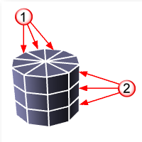
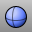
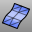

---
---

{: #kanchor1462}{: #kanchor1463}{: #kanchor1464}{: #kanchor1465}{: #kanchor1466}
# MeshSphere
 [Where can I find this command?](javascript:void(0);) Toolbars
 [Mesh Creation](mesh-creation-toolbar.html) 
Menus
Mesh
Polygon Mesh Primitives
Sphere
The MeshSphere command draws a polygon mesh sphere.
Steps
 [Pick](pick-location.html) the center and radius for the base circle.See the [Circle](circle.html) command for option descriptions.Your browser does not support the video tag.Sphere options
4Point
Draws the sphere based on three points that define a circumference and a point to establish the location.
Your browser does not support the video tag.4Point steps
 [Pick](pick-location.html) three points, or two points and aRadius, to define a circle that will lie on the sphere.If no Radius is specified, pick a fourth point to specify the sphere's location.The fourth point sets the size of a sphere constrained by the circle.Mesh options
AroundFaces / VerticalFaces

AroundFaces (1)
The number of faces around the circumference.
VerticalFaces (2)
The number of faces from the base to the apex.
See also
 [Sphere](sphere.html) 
Draw a solid sphere.
 [Mesh](mesh.html) 
Create a mesh from a NURBS surface or polysurface.
&#160;
&#160;
Rhinoceros 6 © 2010-2015 Robert McNeel &amp; Associates.11-Nov-2015
 [Open topic with navigation](meshsphere.html) 

