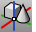

---
---

{: #kanchor1480}{: #kanchor1481}{: #kanchor1482}{: #kanchor1483}{: #kanchor1484}{: #kanchor1485}
# ModelBasepoint
 [Where can I find this command?](javascript:void(0);) Toolbars
 [Block](block-toolbar.html) 
Menus
 [Not on menus.](menuwhattodo.html) 
The ModelBasepoint command sets a base point in a model that is used when inserting the model into another as a block definition.
Steps
 [Pick](pick-location.html) a location.Notes:
By default the base point in any model is 0,0,0.TheModelBasepointcommand lets you set that point. The set base point has no effect in the current file, it is only a handle when inserting it into another Rhino model or when exporting.The [Export](export.html) and [ExportWithOrigin](export.html#exportwithorigin) commands use the current model as a template, so settingModelBasepointand other document settings such as [Model Units Document Properties](units.html) and [Grid Document Properties](grid.html) are copied to the new file.See also
 [Utility functions](sak-utilities.html) 
&#160;
&#160;
Rhinoceros 6 © 2010-2015 Robert McNeel &amp; Associates.11-Nov-2015
 [Open topic with navigation](modelbasepoint.html) 

