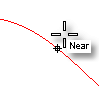
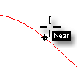
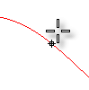

---
---

# Modeling Aids
 [Where can I find this command?](javascript:void(0);) Toolbars
 [Properties](properties-toolbar.html)  [Standard](standard-toolbar.html)  [Tools](tools-toolbar.html) 
Menus
Tools
Options
TheModeling Aidsoptions manage settings for grid and object snaps and construction planes.
Grid snap
Grid Snap on
Turns on [grid snap](snap.html).
See: [Grid Snap](snap.html), [SnapSize](snap.html#snapsize), [SetSnap](snap.html#setsnap).
{: #orthoangle}Ortho Snap every ___ degrees
Turns on [ortho](ortho.html) and sets the [ortho angle](ortho.html#orthoangle).
See: [Ortho](ortho.html), [OrthoAngle](ortho.html#orthoangle), [SetOrtho](ortho.html#setortho).
Planar mode on
Turns on [planar mode](planar.html).
See: [Planar](planar.html), [SetPlanar](planar.html#setplanar).
{: #objectsnaps}Object snaps
Disable object snaps
Temporarily suspends set [object snaps](object-snaps.html).
See: [NoSnap](object-snaps.html#osnap-nosnap).
Project object snaps to CPlane
Projects object snaps to the [construction plane](cplane.html) in the active viewport.
See: [ProjectOsnap.](object-snaps.html#projectosnap) 
Snap to occluded objects.
Allows object snaps to work on objects that are hidden behind other objects.
{: #snap-to-locked-objects}Snap to locked objects
Object snaps work on [locked objects](lock.html) and on objects on locked layers.
See: [SnapToLocked](object-snaps.html#snaptolocked).
Snap to filtered objects
Object snaps work on objects filtered out through [Selection Filter](selection-commands.html#selectionfilter).
Only snap to selected objects
Object snaps work only on [selected](select-objects.html) objects.
{: #snap-to-apparent-intersections}Use apparent intersections
The [Intersection](object-snaps.html#osnap-intersection) object snap does not need to find objects that intersect in 3-D space. The objects only need to appear to intersect in the active viewport.
{: #center-snap-option}Center snap to approximate arcs, circles, and ellipses
The [Center object snap](object-snaps.html#osnap-center) will work on objects that are closeapproximationsof arcs, circles, and ellipses.
Object snap highlight
Highlights the object chosen for use by [object snaps](object-snaps.html).
{: #snapradius}Snap radius ___ pixels
Sets the [object snap](object-snaps.html) activation area radius in pixels. When the cursor is within this distance to the point to snap to, the [marker](cursor-tracking-line.html) jumps to the point to snap to.
Digitizer snap radius ___ units
For digitizers, sets the 3-D [object snap](object-snaps.html) activation area radius in model units. When the cursor is within this distance to the point to snap to, the [marker](cursor-tracking-line.html) jumps to the point to snap to.
Dynamic object snap display
Controls the appearance of the object snap label.
Turning on [cursor tooltips](modeling-aids-cursor-tooltips.html) turns off object snap labels automatically.
Black on white
Displays black lettering in a white box.

White on black
Displays white lettering in a black box.

None
Turns off dynamic object snap display.

Construction planes
Specifies the behavior of [construction planes](sak-cplanes.html) in the viewports.
{: #standard-cplane}Standard construction planes
The construction plane of each viewport is independent from all of the other constructions planes.
{: #universal-cplane}Universal construction planes
The behavior of the construction planes in the viewports is linked. They all share the same origin and are positioned normal to each other. Moving, rotating, or otherwise changing the construction plane in one viewport, changes the construction planes in the other viewports, so the 90-degree/right angle/normal orientation of the construction planes is maintained.
If a construction plane is defined in some view, the Front view for example, and Universal mode is enabled, then the construction plane that was defined will be the Front plane of the new universal plane.
See: [SynchronizeCPlanes](synchronizecplanes.html).
To save options for use on other computers
 [OptionsExport](optionsexport.html) 
Save [Options](options.html) settings to a file.
 [OptionsImport](optionsexport.html#optionsimport) 
Restore [Options](options.html) settings from a file.
See also
 [Options](options.html) 
Manage global options: [3D mouse](3dconnexion.html), [alerter](alerter.html), [aliases](aliases.html), [appearance](appearance.html), [context menu](context-menu.html), [display modes](view-displaymode-options.html), [files](files.html), [general](general.html), [idle processor](idleprocessor.html), [keyboard](keyboard.html), [libraries](libraries.html), [licenses](licenses.html), [modeling aids](#), [mouse](mouse.html), [plug-ins](plug-ins.html), [render](rendering.html), [RhinoScript](rhinoscript.html), [selection menu](selection-menu.html), [toolbars](toolbars.html), [updates and statistics](updates-and-statistics.html), [view](view.html).
&#160;
&#160;
Rhinoceros 6 © 2010-2015 Robert McNeel &amp; Associates.11-Nov-2015
 [Open topic with navigation](modeling-aids.html) 

