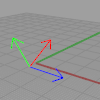

---
---

{: #kanchor1518}{: #kanchor1519}{: #kanchor1520}{: #kanchor1521}
# NamedCPlane
 [Where can I find this command?](javascript:void(0);) Toolbars
 [CPlanes](cplanes-toolbar.html) 
Menus
View
 [Viewport title](rhino-window.html#viewport-title-menu) 
Set CPlane
Named CPlanes
The NamedCPlane command manages the named construction planes list to save, restore, and edit named construction planes.
Steps
To view the construction plane icon, click a construction plane name.To restore a construction plane, double-click a construction plane name.Named CPlanes Panel
 [Panel options](panel-options.html) 
Toolbar
Save As
TheSave Asoption saves a construction plane.
Restore
TheRestoreoption restores a named construction plane to the viewport.
Delete
TheDeleteoption deletes a named construction plane.
Import
TheImportoption imports named construction planes from another file.
To copy a named construction plane to a viewport
Press the&#160; [Ctrl](ctrl-key.html) &#160;key and drag a construction plane name from the Named CPlanes panel to a viewport.This will work between two open models as well as within a model.See also
 [CPlane](cplane.html) 
Set the construction plane in the active viewport.
 [CopyCPlaneSettingsToAll](cplane.html#copycplanesettingstoall) 
Match all viewports' grid and snap settings to the specified viewport.
 [CopyCPlaneToAll](cplane.html#copycplanetoall) 
Match all viewports' construction planes to the specified viewport.
 [MPlane](mplane.html) 
Set up a relationship between a construction plane and an object.
 [Use construction planes](sak-cplanes.html) 
&#160;
&#160;
Rhinoceros 6 © 2010-2015 Robert McNeel &amp; Associates.11-Nov-2015
 [Open topic with navigation](namedcplane.html) 

