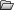

---
---

# NamedView
{: #kanchor1530}
{: #kanchor1529}
{: #kanchor1528}
{: #kanchor1527}
{: #kanchor1526}
{: #kanchor1525}
 [Where can I find this command?](javascript:void(0);) Toolbars
 [Set View](set-view-toolbar.html) 
Menus
Panels
View
 [Viewport title](rhino-window.html#viewport-title-menu) 
Set View
Named Views
The NamedView command manages the named views list to save, restore, and edit named views.
Steps
Right-click in the preview area to toggle the preview between a list and a thumbnail preview.Double-click a view name to restore it in the active viewport.Named Views Panel
 [Panel options](panel-options.html) 
Toolbar
Save As
Saves the current viewport as a named view.
Restore
Regenerates the selected named view.
Delete
Removes the selected named view from the list.
Import from 3dm file
Imports named views from a 3DM file.
Create Using Widget
Adds a new named view widget. This is a visual representation of a named view camera.
Camera widget with control points turned on.
Steps
In theCreate Named View Using Widgetdialog box, type a name for the named view. [Pick](pick-location.html) a camera location.Pick a target location.Pick a field of view.Properties
Opens the Named View Properties dialog box.
{: #namedview-properties}Named View Properties
TheNamed View Propertiesdialog box displays property settings for the selected named view.
For more information about these settings, see: [ViewportProperties](viewportproperties.html).
Edit by looking
Opens a new temporary viewport where you can use [viewport navigation](shortcuts.html#navigation) tools to reset the view.
Animation
Animates the restoration of named view. When you change to a different named view, the view transitions smoothly from the current view to the selected named view. This allows you to see the transition and can also be used to build presentations.
Your browser does not support the video tag.To copy a named view to a viewport
Press the&#160; [Ctrl](ctrl-key.html) &#160;key and drag a view name from the Named Views panel to a viewport.This will work between two open models as well as within a model.Options
Auto-update thumbnails
Updates the thumbnail view when objects are changed, added, or deleted from the viewport.
Show named view widget
Turns the widgets on and off for all selected
Lock named view
Locks the widget so it cannot be changed by moving, dragging, or usingEdit by Looking.
Auto-select named view widgets
Automatically selects the widget when a named view is selected from the list.

### List/thumbnail context menu
The named views list/area displays the named views in the model as either thumbnail views or a list. Right-click a view name or thumbnail to display the context menu.
View Mode
Sets the panel view mode.
List
Displays named views as a list.
Thumbnails
Displays named views as thumbnail previews.
Copy
Copies the current named view inside one Rhino session or between sessions.
Paste
Pastes the copied named view inside one Rhino session or between sessions.
{: #namedviewwidget}Show Named View Widget
Displays a visual representation of a named view camera.

Edit Named View By Looking
Opens a new temporary viewport where you can use [viewport navigation](shortcuts.html#navigation) tools to reset the view.
{: #restore}Restore
Sets the view in the current viewport to the selected named view.
In addition, you can drag a named view from the panel onto any viewport to force that viewport, whether current or not, to restore to the saved view.
To current view
Does not change the viewport's aspect ratio.
To new floating viewport
Restores the size and aspect ratio of the saved view.
Lock Named View
Locks the widget so it cannot be changed by moving, dragging, or usingEdit by Looking.
Delete Named View
Deletes the selected named view.
Rename Named View
Changes the name of the selected named view.
Import Named Views from 3dm File
Imports named views from a 3DM file.
Create Named View Using Widget
Adds a new view widget. This is a visual representation of a named view camera.
{: #save-as}Save Current Viewport As Named View
Saves the current viewport as a named view.
Animation Settings
Opens theNamed View Animation Settingsdialog box.
Named View Animation Settings
Animate named view restoration
Turns the animation feature on.
Constant time
Specifies the number of frames between each view.
Constant speed
Specifies the number of distance units per frame between each view.
Delay between frames __ milliseconds
Specifies the time between frames. This lets you control the speed of the animation.
Properties
Opens theNamed View Propertiesdialog box.
Named View Properties
TheNamed View Propertiesdialog box displays property settings for the selected named view.
For more information about these settings, see: [ViewportProperties](viewportproperties.html).

### Blank area context menu options
To display the context menu
Right-click the blank area in the panel.These are a limited number of the options that appear on the List/Thumbnail context menu.View Mode
Sets the panel view mode.
List
Displays named views as a list.
Thumbnails
Displays named views as thumbnail previews.
Import Named Views from 3dm File
Imports named views from a 3DM file.
Create Named View Using Widget
Adds a new view widget. This is a visual representation of a named view camera.
Save Current Viewport As Named View
Saves the current viewport as a named view.
Animation Settings
Opens theNamed View Animation Settingsdialog box.
Named View Animation Settings
Animate named view restoration
Turns the animation feature on.
Constant time
Specifies the number of frames between each view.
Constant speed
Specifies the number of distance units per frame between each view.
Delay between frames __ milliseconds
Specifies the time between frames. This lets you control the speed of the animation.
See also
 [EditLightByLooking](editlightbylooking.html) 
Set a spotlight direction using view manipulation tools.
 [Navigate in the viewports](sak-navigate.html) 
&#160;
&#160;
Rhinoceros 6 © 2010-2015 Robert McNeel &amp; Associates.11-Nov-2015
 [Open topic with navigation](namedview.html) 

