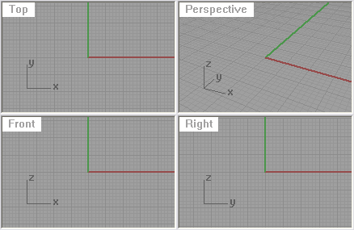
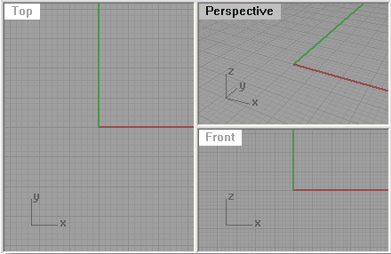

---
---

# New viewport arrangements
These commands control the arrangements of viewports in the Rhino window.

# NewViewport
{: #newviewport}
{: #kanchor6}{: #kanchor7}{: #kanchor8}{: #kanchor9} [Where can I find this command?](javascript:void(0);) Toolbars
 [Viewport Layout](viewport-layout-toolbar.html) 
Menus
View
 [Viewport title](rhino-window.html#viewport-title-menu) 
Viewport Layout
New Viewport
The NewViewport command creates a new [viewport](rhino-window.html).
The following settings match the currently active viewport: [snap spacing](grid.html#grid-snap-spacing), [grid spacing](grid.html#grid-minor-spacing), [major grid line interval](grid.html#grid-major-spacing), [grid extents](grid.html#grid-extents), [grid visibility](grid.html#grid-visibility), [grid axes visibility](grid.html#grid-axes-visibility), and [world axes icon visibility](grid.html#world-icon-visibility).

# NewFloatingViewport
{: #newfloatingviewport}
{: #kanchor10}{: #kanchor11} [Where can I find this command?](javascript:void(0);) Toolbars
 [Viewport Layout](viewport-layout-toolbar.html) 
Menus
View
Viewport Layout
Float Viewport
The NewFloatingViewport command creates a new viewport that can be located outside the bounds of the main [Rhino application window](rhino-window.html).
This allows floating a viewport and dragging it on to another monitor.
The [ToggleFloatingViewport](#togglefloatingviewport) command changes the floating viewport back into the normal Rhino [viewport](rhino-window.html) located inside the [Rhino application window](rhino-window.html).
Floating viewport settings are not saved in the model from one editing session to the next. Closing the model will reset all viewports back to normal Rhino viewports.
You can also copy an existing viewport to a floating viewport with drag and drop.
Command-line options
View projection
Sets the [projection](viewport.html#projection-parallel-perspective) and view for the viewport.
CopyActive
Uses the same projection as the currently active viewport.
 [Perspective](setview.html#worldperspective) 
 [Top](setview.html#worldtop) 
 [Bottom](setview.html#worldbottom) 
 [Left](setview.html#worldleft) 
 [Right](setview.html#worldright) 
 [Front](setview.html#worldfront) 
 [Back](setview.html#worldback) 
 [NamedView](namedview.html) 
Link new viewport to named view
Links the viewport to the Named View so that changes to the viewport update the named view automatically.
Any named view widget displaying the view is also updated, and changes to the named view via the widget are reflected in the floating viewport.
To copy a viewport by dragging
Click and drag a [viewport title](rhino-window.html) outside the viewport docking area.A preview of the viewport appears.
Release the mouse button to drop the viewport copy.
# ToggleFloatingViewport
{: #togglefloatingviewport}
{: #kanchor12}
 [Where can I find this command?](javascript:void(0);) Toolbars
 [Viewport Layout](viewport-layout-toolbar.html) 
Menus
View
 [Viewport title](rhino-window.html#viewport-title-menu) 
Viewport Layout
Float Viewport
The ToggleFloatingViewport command toggles the Rhino [viewport](rhino-window.html) type between a normal viewport docked and a [floating viewport](#newfloatingviewport).
Note
Floating viewports can be located outside the bounds of the main [Rhino application window](rhino-window.html) .This command can be used on model viewports and on [Layout](layout.html) viewports.When used on a layout viewport, all layout viewports in the model use the floating viewport window.Floating viewports work best with multiple monitors.Floating viewport settings are not saved in the model from one editing session to the next. Closing the model will reset all viewports back to normal Rhino viewports.
# 4View
{: #4view}
{: #kanchor13}{: #kanchor14}{: #kanchor15}{: #kanchor16}
 [Where can I find this command?](javascript:void(0);) Toolbars
 [Standard](standard-toolbar.html)  [Viewport Layout](viewport-layout-toolbar.html) 
Menu
View
 [Viewport title](rhino-window.html#viewport-title-menu) 
4 Viewports
The 4View command sets up a four-viewport workspace with parallel [world top](setview.html#worldtop), [world front](setview.html#worldright), and [world right](setview.html#worldfront) views, and a [world perspective](setview.html#worldperspective) view.

Note
If new viewports are created, the following settings match the currently active viewport: [snap spacing](grid.html#grid-snap-spacing), [grid spacing](grid.html#grid-minor-spacing), [major grid line interval](grid.html#grid-major-spacing), [grid extents](grid.html#grid-extents), [grid visibility](grid.html#grid-visibility), [grid axes visibility](grid.html#grid-axes-visibility), and [world axes icon visibility](grid.html#world-icon-visibility).
The4Viewcommand can operate in two different ways:
When views are not in default layout:If four views with the names Top, Front, Right, and Perspective are not located or sized in their default position, all four views are reset to their typical layout. The orientation and construction plane for existing views are not modified.When views are in their default layout:If four views with the names Top, Front, Right, and Perspective are located and sized to their default layout, the orientation and construction planes are reset their default world orientations.Using the command twice in sequence bring all viewport sizes and orientation and their construction planes back to the default locations.
# 3View
{: #3view}
 [Where can I find this command?](javascript:void(0);) Toolbars
 [Viewport Layout](viewport-layout-toolbar.html) 
Menus
View [Viewport title](rhino-window.html#viewport-title-menu) 
3 Viewports
The 3View command sets up a three-viewport workspace with parallel [world top](setview.html#worldtop) and [world front](setview.html#worldfront) views and a [world perspective](setview.html#worldperspective) view.

If new viewports are created, the following settings match the currently active viewport: [snap spacing](grid.html#grid-snap-spacing), [grid spacing](grid.html#grid-minor-spacing), [major grid line interval](grid.html#grid-major-spacing), [grid extents](grid.html#grid-extents), [grid visibility](grid.html#grid-visibility), [grid axes visibility](grid.html#grid-axes-visibility), and [world axes icon visibility](grid.html#world-icon-visibility).

# ReadViewportsFromFile
{: #kanchor19}
{: #kanchor18}
{: #kanchor17}
{: #readviewportsfromfile}
 [Where can I find this command?](javascript:void(0);) Toolbars
 [Set View](set-view-toolbar.html)  [Viewport Layout](viewport-layout-toolbar.html) 
Menus
View
 [Viewport title](rhino-window.html#viewport-title-menu) 
Viewport Layout
Read From File
The ReadViewportsFromFile command sets the [viewport](rhino-window.html) layout in the current model to match the layout in another Rhino model.
Steps
Select the file to read viewports from.The viewport layout and views are changed to match the selected Rhino file.
# CloseViewport
{: #closeviewport}
{: #kanchor20}{: #kanchor21}{: #kanchor22}
 [Where can I find this command?](javascript:void(0);) Toolbars
 [Viewport Layout](viewport-layout-toolbar.html) 
Menus
View
 [Viewport title](rhino-window.html#viewport-title-menu) 
Close Viewport
The CloseViewport command closes the active [viewport](rhino-window.html).

# ViewportTabs
{: #viewporttabs}
{: #kanchor23}
 [Where can I find this command?](javascript:void(0);) Toolbars
 [Viewport Layout](viewport-layout-toolbar.html) 
Menus
View
 [Viewport title](rhino-window.html#viewport-title-menu) 
Viewport Layout
Show/Hide Viewport Tabs
The ViewportTabs command displays a tab control UI along the [viewport](rhino-window.html) edge.
Viewport tabs are useful for managing multiple-page layout style viewports along with standard modeling viewports.

Details
A tab for each viewport or page layout viewport displays.
Click thetab for options [New Layout](#newviewport)  [Import Layout](layout.html#importlayout)  [New Floating Viewport](#newfloatingviewport)  [Split Horizontal](viewport-arrangement.html)  [Split Vertical](viewport-arrangement.html#splitviewportvertical) Double-click a tab to rename a viewport. [Right-click](mouse-buttons.html) a tab to display a context menu for managing viewports.To set the default state at startup, see: [Options &gt; Appearance &gt; Viewport tabs at start](appearance.html#viewport-tabs-at-start) .Scroll the mouse wheel when it is over the tabs to cycle through the tabs.Command-line options
{: #showtabs}Show/Hide/Toggle
Shows, hides, or toggles the viewport tab visibility.
{: #taborientation}Align
Sets the location of the viewport tabs relative to the Rhino window.
Bottom
Top
Left
Right
ModelTabs
Separate
Displays one tab for each model viewport.
{: #modeltabscombine}Combined
Combines all model tabs into one tab. This is useful when working on layout viewports.
Context menu options
 [New Viewport](#newviewport)  *(Model viewports only)* 
 [New Layout](layout.html) 
 [New Detail](detail.html)  *(Layout viewports only* )
 [Delete](#closeviewport) 
 [Rename](viewport.html#title) 
Move or Copy
Layout viewports only. Changes the page order or copies the page.
Before
Moves the layout page in front of the specified page.
Move to end
Moves the layout page to the end of the layout pages.
Create a copy
Copies the layout page.
 [Combined Model Tab](#modeltabscombine) 
 [Tab Orientation](#taborientation) 
 [Hide Tabs](#showtabs) 
 [Layout Properties](layout.html#layoutproperties)  *(Layout viewports only* )
 [Print](print.html) 
See also
 [Manage viewports](sak-viewports.html) 
&#160;
&#160;
Rhinoceros 6 © 2010-2015 Robert McNeel &amp; Associates.11-Nov-2015
 [Open topic with navigation](new-viewport-arrangements.html) 

