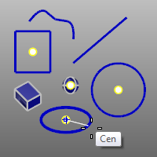
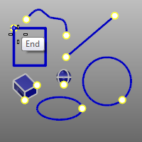

---
---

# Object Snap toolbar
{: #kanchor2356}
 [To open a toolbar](javascript:void(0);) Toolbars can be opened as a free-standing group or added to the current group.
To open a toolbar as a free-standing group
Click theOptionsicon in any toolbar group.On the menu, clickShow Toolbar, and then select the toolbar name from the list.To open a toolbar as a new tab in the current group
Click theOptionsicon in the toolbar group where you want to add the new tab.On the menu, clickShow or Hide Tabs, and then select the toolbar name from the list. [AlongLine object snap](object-snaps.html#osnap-alongline) 
Track along a line.
 [AlongParallel object snap](object-snaps.html#osnap-alongparallel) 
Track along a line parallel to a reference line between two points.
 [Between object snap](object-snaps.html#osnap-between) 
Snap midway between two specified locations.
 [Center object snap](object-snaps.html#osnap-center) 
Snap to the center of a circle, arc, closed polyline, or annotation text bounding box.
 [Center object snap, *Persistent* ](object-snaps.html#osnap-center) 
The Center object snap persists until turned off.
 [DisableOsnap](object-snaps.html#disableosnap) 
Manage persistent object snaps.
 [End object snap](object-snaps.html#osnap-end) 
Snap to the end of a curve.
 [End object snap, *Persistent* ](object-snaps.html#osnap-end) 
The End object snap persists until turned off.
 [From object snap](object-snaps.html#osnap-from) 
Snap from a specified base point.
 [Grid, *Size* ](grid.html) 
Sets the grid size for the current model.
 [SnapSize](snap.html#snapsize) 
Specify the grid snap spacing.
 [Intersection object snap](object-snaps.html#osnap-intersection) 
Snap to the intersections of curves, edges, and [isoparametric curves](isocurve.html) on a surface.
 [Intersection object snap, *Persistent* ](object-snaps.html#osnap-intersection) 
The Intersection object snap persists until turned off.
 [Knot object snap](object-snaps.html#osnap-knot) 
Snap to a knot on a curve or surface.
 [Knot object snap, *Persistent* ](object-snaps.html#osnap-knot) 
The Knot object snap persists until turned off.
 [Midpoint object snap](object-snaps.html#osnap-midpoint) 
Snap to the midpoint of a curve or surface edge.
 [Midpoint object snap, *Persistent* ](object-snaps.html#osnap-midpoint) 
The Midpoint object snap persists until turned off.
Multiple object snaps:
 * [End, Point, Mid, Cen, Int, Tan, Perp and Quad](object-snaps.html) * 
The multiple object snaps persist until turned off.
Multiple object snaps:
 * [End, Point, Mid, Cen, Int, Tan, Perp and Quad, Persistent](object-snaps.html) * 
 [Near object snap](object-snaps.html#osnap-near) 
Snap onto a curve at the cursor location.
 [Near object snap, *Persistent* ](object-snaps.html#osnap-near) 
The Near object snap persists until turned off.
 [NoSnap object snap](object-snaps.html#osnap-nosnap) 
Turn off persistent object snaps for one pick.
 [OSnap, *None* ](object-snaps.html#osnap-nosnap) 
Clears all persistent object snaps.
 [OnCrv object snap](object-snaps.html#osnap-oncrv) 
Snap to and track along a selected curve for one pick.
 [OnCrv object snap, *Persistent* ](object-snaps.html#osnap-oncrv) 
The OnCrv object snap persists until a command completes.
 [OnPolysurface object snap](object-snaps.html#osnap-onpolysrf) 
Snap to and track over a polysurface for one pick.
 [OnPolysurface object snap, *Persistent* ](object-snaps.html#osnap-onpolysrf) 
The OnPolysurface object snap persists until a command completes.
 [OnSurface object snap](object-snaps.html#osnap-onsrf) 
Snap to and track over a surface for one pick.
 [OnSurface object snap, *Persistent* ](object-snaps.html#osnap-onsrf) 
The OnSurface object snap persists until a command completes.
 [Ortho](ortho.html) 
Restrict cursor movement to an angle.
 [OrthoAngle](ortho.html#orthoangle) 
Set the angle for cursor ortho movement.
 [Perpendicular (To) object snap](object-snaps.html#osnap-perp) 
Snap perpendicular to a curve.
 [Perpendicular (To) object snap, *Persistent* ](object-snaps.html#osnap-perp) 
The Perpendicular object snap persists until turned off.
 [PerpendicularFrom object snap](object-snaps.html#osnap-perpendicularfrom) 
Track along a line perpendicular to a curve.
 [Point object snap](object-snaps.html#osnap-point) 
Snap to a [point object](points.html), [control point](controlpoint.html), [edit point](pointson.html#editpton), and [block](block.html) or [text](text.html) insertion point.
 [Point object snap, *Persistent* ](object-snaps.html#osnap-point) 
The Point object snap persists until turned off.
 [ProjectOsnap](object-snaps.html#projectosnap) 
Project object snaps to the construction plane.
 [Quadrant object snap](object-snaps.html#osnap-quad) 
Snap to the point on a curve that is at the maximum x or y point relative to the current construction plane.
 [Quadrant object snap, *Persistent* ](object-snaps.html#osnap-quad) 
The Quadrant object snap persists until turned off.
 [ShowOsnap](object-snaps.html#showosnap) 
Turn the Osnap control on.
 [ShowOsnap, *Hide* ](object-snaps.html#showosnap) 
Turn the Osnap control off.
 [SmartTrack](modeling-aids-smarttrack.html) 
Turn on a system of temporary reference lines and points.
 [SmartTrack,Off](smarttrack.html) 
Turns off SmartTrack.
 [SmartTrack,Options](modeling-aids-smarttrack.html) 
Specify SmartTrack options.
 [SnapToLocked](object-snaps.html#snaptolocked) 
Allow snaps to work on locked objects and locked layers.
 [Tangent (To) object snap](object-snaps.html#osnap-tan) 
Snap tangent to a curve.
 [Tangent (To) object snap, *Persistent* ](object-snaps.html#osnap-tan) 
The Tangent object snap persists until turned off.
 [TangentFrom object snap](object-snaps.html#osnap-tangentfrom) 
Track along a line tangent to a curve.
 [Vertex object snap](object-snaps.html#osnap-vertex) 
Snap to a mesh [vertex](meshvertex.html).
&#160;
&#160;
Rhinoceros 6 © 2010-2015 Robert McNeel &amp; Associates.11-Nov-2015
 [Open topic with navigation](object-snap-toolbar.html) 

