---
---

# Object snaps
{: #kanchor622}
 [Where can I find this command?](javascript:void(0);) Toolbars
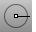 [Object Snap](object-snap-toolbar.html) 
Menus
The menu versions turn the object snaps on for one pick only. For persistent object snaps, use the [Osnap](#showosnap) control.
Tools
Object Snap
The object snaps constrain the [marker](cursor-tracking-line.html) to an exact location on an object such as the end of a line or the center of a circle.
When Rhino asks you to choose a point, you can constrain the [marker](cursor-tracking-line.html) to specific parts of existing objects by turning on object snap modes. When an object snap is active, moving the cursor near a specified point on an object causes the [marker](cursor-tracking-line.html) to jump to that point.
Object snaps can persist from pick to pick, or can be activated for one pick only. Multiple persistent object snaps can be set in the [Osnap](#osnap-dialog) control. All object snaps behave similarly, but snap to different parts of existing geometry.
For example, the End object snap finds the endpoint of a curve. When activated, the end object snap constrains the [marker](cursor-tracking-line.html) to the endpoint of the curve closest the cursor.
Multiple object snaps
More than one object snap can be active at the same time. As the cursor passes over an object, the appropriate object snap displays.
Persistent object snaps
Use persistent objects snaps to maintain an object snap through choosing several points without having to reactivate the object snap. Only [Cen](#osnap-center), [End](#osnap-end), [Int](#osnap-intersection), [Knot](#osnap-knot), [Mid](#osnap-midpoint), [Near](#osnap-near), [Perp](#osnap-perp), [Point](#osnap-point), [Quad](#osnap-quad), [Tan](#osnap-tan), and [Vertex](#osnap-vertex) object snaps can persist.
You can set the [Snap radius](modeling-aids.html#snapradius) for object snaps. This means how close you have to move the cursor to the point before the [marker](cursor-tracking-line.html) jumps to the point.
{: #osnap-dialog}To display the Osnap control
On the [status bar](rhino-window.html#appwindow-statusbar), clickOsnap.Select or clear the desired object snap check boxes.To turn off all persistent object snaps{: #kanchor623}{: #kanchor624}{: #kanchor625}
ClickDisable.Disabling the object snaps suspends their use temporarily. When theDisablecheck box is cleared, all previously set object snaps turn back on.To clear check boxes
 [Right-click](mouse-buttons.html) to toggle the checked/cleared state of all but the selected check box.{: #altkey}To clear all persistent object snaps{: #kanchor626}{: #kanchor627}{: #kanchor628}{: #kanchor629}
 [Right-click](mouse-buttons.html) Disable.Press [Alt](alt-key.html) to temporarily suspend object snaps.If object snaps are disabled, press [Alt](alt-key.html) to toggle them on temporarily.One-shot object snaps
One-shot object snaps only work when Rhino is requesting a point, are turned on for one [pick](pick-location.html) only, and override all persistent object snaps for that pick.
To set a one-shot object snap
Press [Shift](shift-key.html) and click an object snap check box.For example, if [End](#osnap-end), [Near](#osnap-near), and [Point](#osnap-point) persistent object snaps are set in the Osnap control, and you set the [Mid](#osnap-midpoint) object snap for one pick, [End](#osnap-end), [Near](#osnap-near), and [Point](#osnap-point) will not work for that pick. After the pick, the persistent object snaps will reactivate.Object snaps when dragging
When object snaps are on, click and hold near object snap locations to use them for the start or end locations of the drag.
To suspend object snaps for the drag, press and hold [Alt](alt-key.html) .Your browser does not support the video tag.Drag line from midpoint to circle center.

Project object snaps
TheProjectbutton on theOsnapcontrol projects any object snap to the current construction plane. For example, in the illustration, the curve projects to the construction plane from snapped locations on an object.
Your browser does not support the video tag.See: [ProjectOsnap](#projectosnap) 
Object snap culling
Object snaps work on visible objects only. Objects that are obscured by other objects cannot be snapped to, except by theMidobject snap.
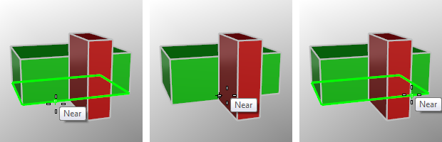
When the cursor passes behind the red box, the object snap turns off.

## Simple object snaps
Simple object snaps snap to one location on an object.
Steps
Move the cursor near the target object.When the [marker](cursor-tracking-line.html) jumps to the snap location, click the [left mouse button](mouse-buttons.html).
### NoSnap
{: #kanchor631}
{: #kanchor630}
{: #osnap-nosnap}
If a command is active,NoSnapturns off persistent object snaps for one pick.

### Cen (Center)
{: #kanchor638}
{: #kanchor637}
{: #kanchor636}
{: #kanchor635}
{: #kanchor634}
{: #kanchor633}
{: #kanchor632}
{: #osnap-center}
Snap to the center of a circle, arc, closed polyline, centers of single surfaces with a polyline outer boundary and no holes, and annotation text bounding box.
It is possible to set the Center snap to also use the centers of approximate arcs, circles and ellipses. The tolerance used for determining if the shape is exact is the same as the [What](what.html) command uses; so if the [What](what.html) command says the curve is an arc, circle, or ellipse, the Center snap should work.
See: [Modeling Aids Options](modeling-aids.html#center-snap-option).
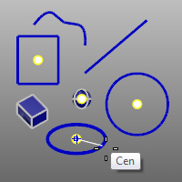
Examples of Center object snap.

### End
{: #kanchor642}
{: #kanchor641}
{: #kanchor640}
{: #kanchor639}
{: #osnap-end}
Snap to the end of a curve, text corners, interior vertices of [polylines](polyline.html) and joined curves, the [seam](crvseam.html) point on closed curves, and the "corners" of surfaces, and polysurfaces.
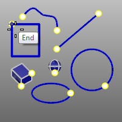
Examples of End object snap.

### Intersection (Int)
{: #kanchor648}
{: #kanchor647}
{: #kanchor646}
{: #kanchor645}
{: #kanchor644}
{: #kanchor643}
{: #osnap-intersection}
Snap to the intersections of curves, edges, mesh wires, and [isoparametric curves](isocurve.html) on a surface.
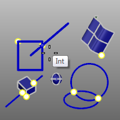
Examples of Intersection object snap.

### Knot
{: #kanchor652}
{: #kanchor651}
{: #kanchor650}
{: #kanchor649}
{: #osnap-knot}
Snap to a [knot](knot.html) on a curve or surface.
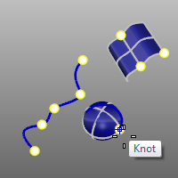
Examples of Knot object snap.

### Mid (Midpoint)
{: #kanchor658}
{: #kanchor657}
{: #kanchor656}
{: #kanchor655}
{: #kanchor654}
{: #kanchor653}
{: #osnap-midpoint}
Snap to the midpoint of a curve, surface edge, mesh wire, or a segment of a polycurve.
If no other object snap is active (including Near and Center), the Mid object snap works anywhere along a curve, even if the midpoint is obscured by another object.
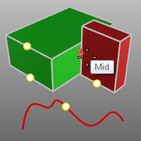
Examples of Midpoint object snap.

### Near
{: #kanchor662}
{: #kanchor661}
{: #kanchor660}
{: #kanchor659}
{: #osnap-near}
Snap onto a curve, mesh wire, or surface edge at the cursor location.
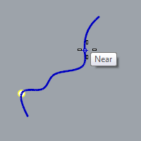
Example of the Near object snap.

### Perp (Perpendicular)
{: #kanchor668}
{: #kanchor667}
{: #kanchor666}
{: #kanchor665}
{: #kanchor664}
{: #kanchor663}
{: #osnap-perp}
Snap perpendicular to a curve, mesh wire, or surface edge.
ThePerpendicularobject snap is not effective for the first point for a command.
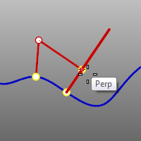
Examples of the Perp object snap.

### Point
{: #kanchor674}
{: #kanchor673}
{: #kanchor672}
{: #kanchor671}
{: #kanchor670}
{: #kanchor669}
{: #osnap-point}
Snap to a [point object](point.html), [extrusion axis](rhinoobjects.html#lightweightextrusions), [control point](pointson.html), [edit point](pointson.html#editpton), [block](block.html), and [text](text.html) insertion points.
Also snaps to centers and corners of rectangular lights and block insertion points even if control points are not displayed.
When selecting points by name, if multiple points share a name, the most recently created or edited point is selected.
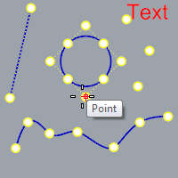

### Quad (Quadrant)
{: #kanchor679}
{: #kanchor678}
{: #kanchor677}
{: #kanchor676}
{: #kanchor675}
{: #osnap-quad}
Snap to the point on a curve that is at the maximum x or y point relative to the current construction plane.
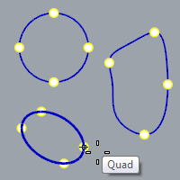
Note
The quadrant points of [circles](circle.html) and [arcs](arc.html) are at the extremes in each construction plane axis direction. [Ellipses](ellipse.html) have quadrant points at the ends of the ellipse axes if the ellipse is oblique in addition to those at the construction plane extremes.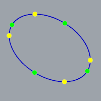
### Tan (Tangent)
{: #kanchor685}
{: #kanchor684}
{: #kanchor683}
{: #kanchor682}
{: #kanchor681}
{: #kanchor680}
{: #osnap-tan}
Snap tangent to a curve.
TheTanobject snap is not effective for the first point for a command.
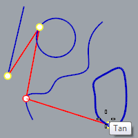
Examples of Tangent object snap.

### Vertex
{: #kanchor688}
{: #kanchor687}
{: #kanchor686}
{: #osnap-vertex}
Snap to a [mesh vertex](meshvertex.html).
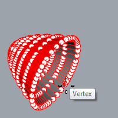
Note
Use the [CullControlPolygon](cullcontrolpolygon.html) to disable snapping to vertices on the back side of mesh objects.Mesh vertices donothave to be turned on when using the Vertex snap.
## Object snaps using references
When picking points during these steps, use simple snaps (End,Near,Point,Midpoint,Center,Intersection, andQuadrant) for greater precision.
To access reference object snaps from the Osnap control
Press the [Ctrl](ctrl-key.html) key and hover over theOsnapcontrol.The alternate reference object snaps appear.
### Along
{: #kanchor694}
{: #kanchor693}
{: #kanchor692}
{: #kanchor691}
{: #kanchor690}
{: #kanchor689}
{: #osnap-alongline}
Track along a line.
Along example
Start a circle located on the line between the center of the circle and the end of a line.
Along steps
 [Pick](pick-location.html) the start of the tracking line (the center of the circle).Pick the end of the tracking line (the end of the line).The [marker](cursor-tracking-line.html) moves only along the tracking line.Click the [left mouse button](mouse-buttons.html) to specify the location.Your browser does not support the video tag.To access this object snap on theOsnapcontrol, press and hold the [Ctrl](ctrl-key.html) &#160;key and hover the mouse over theOsnapcontrol.

### AlongParallel
{: #kanchor697}
{: #kanchor696}
{: #kanchor695}
{: #osnap-alongparallel}
Track along a line parallel to a reference line between two points.
AlongParallel example
Start a line along a line parallel to the rectangle that passes through the circle's center.
AlongParallel steps
 [Pick](pick-location.html) the start of the base line (the corner of the box).Pick the end of the base line (the other corner of the box).Pick the start point for parallel tracking (the Center of the circle).The [marker](cursor-tracking-line.html) moves only along the tracking line.Click the [left mouse button](mouse-buttons.html) to specify the location for the start of the line.Your browser does not support the video tag.To access this object snap on theOsnapcontrol, press and hold the [Ctrl](ctrl-key.html) &#160;key and hover the mouse over theOsnapcontrol.

### Between
{: #kanchor701}
{: #kanchor700}
{: #kanchor699}
{: #kanchor698}
{: #osnap-between}
Snap midway between two specified locations.
Between example
Center a circle between two rectangles
Between steps
 [Pick](pick-location.html) the first reference point.Pick the second reference point.Your browser does not support the video tag.To access this object snap on theOsnapcontrol, press and hold the [Ctrl](ctrl-key.html) &#160;key and hover the mouse over theOsnapcontrol.

### From
{: #kanchor706}
{: #kanchor705}
{: #kanchor704}
{: #kanchor703}
{: #kanchor702}
{: #osnap-from}
Snap from a specified base point.
Note
TheFromobject snap differs from the rest of the object snap because it is used to set the base point for [ortho](cursor-constraints.html), [distance constraint](cursor-constraints.html#distance-constraint), [angle constraint](cursor-constraints.html#angle), and [relative coordinate entry](unit-systems.html#relative-construction-plane-and-world-coordinates). [Ortho](cursor-constraints.html) constrains the [marker](cursor-tracking-line.html) to lines radiating from the last pick point. Similarly, distance constraint constrains the [marker](cursor-tracking-line.html) to a circle of a specified radius from the last pick point. You can set this point, without picking it, with theFromobject snap.From example
Center a circle four units from the endpoint of a line.
From steps
Snap the base point to the end of the line.Type4and press [Enter](enter-key.html) .The [marker](cursor-tracking-line.html) is constrained to four units from the endpoint of the line.Click to place the circle's Center point and pick the radius.Your browser does not support the video tag.To access this object snap on theOsnapcontrol, press and hold the [Ctrl](ctrl-key.html) &#160;key and hover the mouse over theOsnapcontrol.

### PerpendicularFrom
{: #kanchor712}
{: #kanchor711}
{: #kanchor710}
{: #kanchor709}
{: #kanchor708}
{: #kanchor707}
{: #osnap-perpendicularfrom}
Track along a line perpendicular to a curve or surface.
PerpendicularFrom example
Draw a line perpendicular from a line at the intersection with the circle.
PerpendicularFrom steps
 [Select](select-objects.html) the curve.The cursor moves only along the curve. Cross-hairs appear to indicate the perpendicular and tangent lines that extend from any point on the curve. [Pick](pick-location.html) the point on the curve to extend the perpendicular line from.The [marker](cursor-tracking-line.html) tracks along the perpendicular line.Click the [left mouse button](mouse-buttons.html) to start the line.Your browser does not support the video tag.To access this object snap on theOsnapcontrol, press and hold the [Ctrl](ctrl-key.html) &#160;key and hover the mouse over theOsnapcontrol.

### TangentFrom
{: #kanchor718}
{: #kanchor717}
{: #kanchor716}
{: #kanchor715}
{: #kanchor714}
{: #kanchor713}
{: #osnap-tangentfrom}
Track along a line tangent to a curve.
TangentFrom example
Draw a line tangent from the circle at the intersection with the line.
TangentFrom steps
 [Select](select-objects.html) the circle.The [marker](cursor-tracking-line.html) moves only along the circle. Cross-hairs indicate the perpendicular and tangent lines that extend from any point on the circle. [Pick](pick-location.html) the point on the circle to extend the tangent line from.The [marker](cursor-tracking-line.html) tracks along on the tangent line.Click the [left mouse button](mouse-buttons.html) to start the line.Your browser does not support the video tag.To access this object snap on theOsnapcontrol, press and hold the [Ctrl](ctrl-key.html) &#160;key and hover the mouse over theOsnapcontrol.

## Object snaps on an object
 [Where can I find this command?](javascript:void(0);) Toolbars
 [Object Snap](object-snap-toolbar.html) 
Menus
Tools
Object Snap
On Object

### OnCurve
{: #kanchor726}
{: #kanchor725}
{: #kanchor724}
{: #kanchor723}
{: #kanchor722}
{: #kanchor721}
{: #kanchor720}
{: #kanchor719}
{: #osnap-oncrv}
Snap to and track along a selected curve for one pick.
Notes
TheOnCrvobject snap is useful if the model is complex andNearobject snap alone does not lock to the object you would like it to.The curve parameter displays in the status bar when moving the mouse along the curve.OnCurve example
Select the curve to move a control point along.
OnCurve steps
 [Select](select-objects.html) the curve.The [marker](cursor-tracking-line.html) moves only along the selected curve.Click the [left mouse button](mouse-buttons.html) to place the point.Your browser does not support the video tag.To access this object snap on theOsnapcontrol, press and hold the [Ctrl](ctrl-key.html) &#160;key and hover the mouse over theOsnapcontrol.

### PersistentOnCurve
{: #kanchor730}
{: #kanchor729}
{: #kanchor728}
{: #kanchor727}
{: #osnap-persistentoncrv}
Snap to and track along a selected curve until the command completes.
To access this object snap on theOsnapcontrol, press and hold the [Ctrl](ctrl-key.html) &#160;key and hover the mouse over theOsnapcontrol.

### OnPolysurface
{: #kanchor732}
{: #kanchor731}
{: #osnap-onpolysrf}
Snap to and track over a polysurface for one pick.
OnPolysurface example
Place a point object on a polysurface.
OnPolysurface steps
 [Select](select-objects.html) the polysurface.The [marker](cursor-tracking-line.html) moves only over the polysurface.Click the [left mouse button](mouse-buttons.html) to place the points.Your browser does not support the video tag.To access this object snap on theOsnapcontrol, press and hold the [Ctrl](ctrl-key.html) &#160;key and hover the mouse over theOsnapcontrol.

### PersistentOnPolysurface
{: #kanchor737}
{: #kanchor736}
{: #kanchor735}
{: #kanchor734}
{: #kanchor733}
{: #osnap-persistentonpolysrf}
Snap to and track over a polysurface until the command completes.
To access this object snap on theOsnapcontrol, press and hold the [Ctrl](ctrl-key.html) &#160;key and hover the mouse over theOsnapcontrol.
{: #osnap-onmesh}OnMesh{: #kanchor738}{: #kanchor739}{: #kanchor740}{: #kanchor741}
Snap to and track along a selected mesh object for one pick.
OnMesh steps
 [Select](select-objects.html) the mesh.The [marker](cursor-tracking-line.html) moves only along the selected mesh.Click the [left mouse button](mouse-buttons.html) to place the point.{: #osnap-persistentonmesh}PersistentOnMesh{: #kanchor742}{: #kanchor743}{: #kanchor744}
Snap to and track along a selected mesh until the command completes.

### OnSurface
{: #kanchor753}
{: #kanchor752}
{: #kanchor751}
{: #kanchor750}
{: #kanchor749}
{: #kanchor748}
{: #kanchor747}
{: #kanchor746}
{: #kanchor745}
{: #osnap-onsrf}
Snap to and track over a surface for one pick.
OnSurface example
Place a point object on a surface.
OnSurface steps
 [Select](select-objects.html) the surface.The [marker](cursor-tracking-line.html) moves only over the surface.Click the [left mouse button](mouse-buttons.html) to place the point.If you are tracking over a polysurface, the marker is restricted to the single selected face. The cursor changes shape to indicate that you cannot pick. To track over the whole polysurface, see the [OnPolysrf](#osnap-onpolysrf) object snap.Your browser does not support the video tag.To access this object snap on theOsnapcontrol, press and hold the [Ctrl](ctrl-key.html) &#160;key and hover the mouse over theOsnapcontrol.

### PersistentOnSurface
{: #kanchor754}
{: #osnap-persistentonsrf}
Snap to and track over a surface until the command completes.
To access this object snap on theOsnapcontrol, press and hold the [Ctrl](ctrl-key.html) &#160;key and hover the mouse over theOsnapcontrol.
{: #osnap-percentage}Percentage{: #kanchor755}{: #kanchor756}{: #kanchor757}
Snap to a curve a percentage from the end.
The curve is marked with temporary black points that are automatically snapped to.
If the percentage is less than 50, the curve is marked with multiple snap points. For example, when using 30, you get snap points at 30%, 60% and 90%.
To access this object snap on theOsnapcontrol, press and hold the [Ctrl](ctrl-key.html) &#160;key and hover the mouse over theOsnapcontrol.

## Isoparametric curve snapping
You can snap to surface [isoparametric curves](isocurve.html) using the [Int](#osnap-intersection) object snap whenever the input is constrained to a surface, for example in [ExtractIsocurve](extractisocurve.html), [InsertKnot](insertknot.html), [OrientOnSrf](orientonsrf.html), and with [OnSrf](#osnap-onsrf), and [OnPolysrf](#osnap-onpolysrf) one-shot object snaps.
 [isoparametric curves](isocurve.html) object snapping is "weaker" than normal object snaps. The normal object snaps are evaluated first, and only if they fail will Rhino try to snap to the isoparametric curve intersections.
Scripting one-shot object snaps
One-shot object snaps are automatically transparent. In other words, when scripting these, you do not need to use the apostrophe character to make the object snap work while a command is running.

# Related commands

## Osnap
{: #kanchor759}
{: #kanchor758}
{: #osnap}
 [Where can I find this command?](javascript:void(0);) Toolbars
 [Not on toolbars.](toolbarwhattodo.html) 
Menus
Tools
Object Snap
Status bar
Osnap
TheOsnapcommand sets the status of object snaps from the command line.
Steps
 [Specify a command line option.](specifycommandlineoption.html) Note
This command is useful for scripting, because it can set any object snap combination from command line.You can temporarily suspend the effect of the object snaps with the [DisableOsnap](#disableosnap) command.
### ShowOsnap
{: #kanchor763}
{: #kanchor762}
{: #kanchor761}
{: #kanchor760}
{: #showosnap}
 [Where can I find this command?](javascript:void(0);) Toolbars
 [Object Snap](object-snap-toolbar.html)  [Standard](standard-toolbar.html) 
Menus
 [Not on menus.](menuwhattodo.html) 
TheShowOsnapcommand turns theOsnapcontrol on, off, or toggles the current state.
Steps
 [Specify a command line option.](specifycommandlineoption.html) Options
Show
Hide
Toggle

### DisableOsnap
{: #kanchor765}
{: #kanchor764}
{: #disableosnap}
 [Where can I find this command?](javascript:void(0);) Toolbars
 [Object Snap](object-snap-toolbar.html) 
Menus
Tools
Object Snap
Disable Object Snaps
TheDisableOsnapcommand manages the state of persistent object snaps.
To temporarily turn off persistent object snaps from the control
In theOsnapcontrol, click theDisablebutton.When Object snaps are disabled, persistent object snaps are temporarily suspended.To reactivate persistent object snaps from the control
In theOsnapcontrol, deactivate theDisablebutton.All persistent object snaps will be reactivated.To clear all persistent object snaps from the control
In theOsnapcontrol, [right-click](mouse-buttons.html) theDisablebutton.To temporarily turn off persistent object snaps from the command line
Click an option.Command-line options
Enable
Disable
Toggle
To access disabled object snaps
When object snaps are disabled, press [Shift](shift-key.html) to activate them for one pick.Press [Ctrl](ctrl-key.html) to activate one-shot object snaps when object snaps are disabled.
### ProjectOsnap
{: #kanchor769}
{: #kanchor768}
{: #kanchor767}
{: #kanchor766}
{: #projectosnap}
 [Where can I find this command?](javascript:void(0);) Toolbars
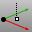 [Object Snap](object-snap-toolbar.html) 
Menus
Tools
Object Snap
Project to Plane
TheProjectOsnapcommand projects object snaps from the actual snap point to the construction plane.
Steps
 [Specify a command line option.](specifycommandlineoption.html) When Osnap projection is on, and the cursor is over an object snap point, the [marker](cursor-tracking-line.html) projects to the current construction plane with a white tracking line between it and the cursor.If [Planar](planar.html) mode is on, theProjectOsnapcommand will project the object snap to the "virtual plane" that is set by the planar mode.When projection is on, the prefix "Projected" is added to the tooltip as a reminder.Command-line options
Enable
Disable
Toggle

### SnapToLocked
{: #kanchor771}
{: #kanchor770}
{: #snaptolocked}
 [Where can I find this command?](javascript:void(0);) Toolbars
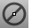 [Object Snap](object-snap-toolbar.html) 
Menus
Tools
Object Snap
Snap To Locked Objects
TheSnapToLockedcommand snaps work on [locked objects](lock.html) and on objects on [locked layers](layer.html#lock).
See also
 [Model with precision](sak-precisionmodeling.html) 
 [Cursor constraints](cursor-constraints.html) 
&#160;
&#160;
Rhinoceros 6 © 2010-2015 Robert McNeel &amp; Associates.11-Nov-2015
 [Open topic with navigation](object-snaps.html) 

