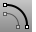
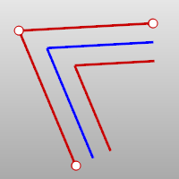
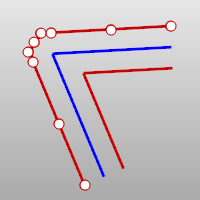
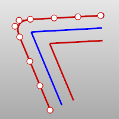
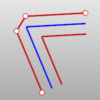
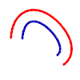
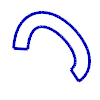
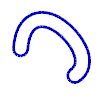

---
---

{: #kanchor1552}
# Offset
 [Where can I find this command?](javascript:void(0);) Toolbars
 [Curve Tools](curve-tools-toolbar.html) 
Menus
Curve
Offset Curve
 [&#160;History enabled](historyenabled.html) 
The Offset command copies a curve so that all locations on the copied curve are a specified distance from the original curve.
Steps
 [Select](select-objects.html) a curve or edge.Click on one side the curve.For best results, use proportionately small offset distances and smooth curves; otherwise, you may get kinks and doubled-back curves.Your browser does not support the video tag.Command-line options
Distance
Sets the offset distance.
Loose
TheCornerandToleranceoptions are not shown and do not affect the output. Polycurves are offset as a group of separate curve segments, and there is no corner trimming or filling.
Corner
Specifies how offset corner [continuity](continuity-descriptions.html) handled. These options only apply if the offset direction is to the "outside" as shown in the image.

Original curve (blue). Offset to outside (red). Offset to inside (green).
Sharp
Curves offset to the outside of a corner will be extended to meet at sharp corners with position (G0) continuity.

Round
Curves offset to the outside of a corner will be filled with arc segments with tangent (G1) continuity.

Smooth
Curves offset to the outside of a corner will be filled with blend segments with curvature (G2) continuity.

Chamfer
The corners of the offset curves will be filled with a straight line between their endpoints.

ThroughPoint
Offsets through a picked point instead of at a distance.
Tolerance
Sets the tolerance for the offset curve.
Type 0 to use the [default system tolerance](units.html#absolutetolerance).
BothSides
Offsets the curve on both sides of the input curve.
InCPlane
The curve is offset in the plane of the original curve. This option offsets the curve in the plane of the current construction plane instead.
Cap
Closes the gap at the curve ends.
None
No closing segments are added. The offset curve goes on the current layer.

Flat
Straight-line segments are added between the curves and joined. The object goes the same layer as the original.

Round
Tangent arcs are added between the curves and joined. The object goes the same layer as the original.

See also
 [OffsetMesh](offsetmesh.html) 
Copy a mesh parallel to the original.
 [OffsetCrvOnSrf](offsetcrvonsrf.html) 
Copy a curve on a surface parallel to the original.
 [OffsetNormal](offsetnormal.html) 
Copy a curve on a surface parallel to the original in the surface normal direction.
 [OffsetMultiple](offsetmultiple.html) 
Copy curves or surface edges parallel to the original.
 [Create curves from other objects](sak-curvefromobject.html) 
&#160;
&#160;
Rhinoceros 6 © 2010-2015 Robert McNeel &amp; Associates.11-Nov-2015
 [Open topic with navigation](offset.html) 

