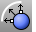

---
---

{: #kanchor1556}
# OffsetNormal
 [Where can I find this command?](javascript:void(0);) Toolbars
 [Curve Tools](curve-tools-toolbar.html) 
Menus
Curve
Offset
Offset Normal to Surface
The OffsetNormal command copies a curve on a surface in the normal direction of the surface so that all locations on the copied curve are a specified distance from the original curve.
Steps
 [Select](select-objects.html) a curve on a surface.Select the base surface.Infinite Plane: TypeIPfor [InfinitePlane](infiniteplane.html) options.
Specify the offset distance.The selected curve is pulled back to the surface first. The offset distance is calculated from the surface.
Pick a location to set another distance, or press [Enter](enter-key.html) if the offset should be a uniform distance from the original.Your browser does not support the video tag.Command-line options
SetBasePoint
Specifies the first point for a distance for the offset if it should be different from the point where the curve was selected.
Flip
Reverses the [direction](dir.html#normaldirection).
Positive values for the distance follow the direction arrows.
See also
 [Create curves from other objects](sak-curvefromobject.html) 
&#160;
&#160;
Rhinoceros 6 © 2010-2015 Robert McNeel &amp; Associates.11-Nov-2015
 [Open topic with navigation](offsetnormal.html) 

