---
---

# Organic toolbar
{: #kanchor2357}
 [To open a toolbar](javascript:void(0);) Toolbars can be opened as a free-standing group or added to the current group.
To open a toolbar as a free-standing group
Click theOptionsicon in any toolbar group.On the menu, clickShow Toolbar, and then select the toolbar name from the list.To open a toolbar as a new tab in the current group
Click theOptionsicon in the toolbar group where you want to add the new tab.On the menu, clickShow or Hide Tabs, and then select the toolbar name from the list. [Compress along X](scale1d.html) 
Scale objects and distances smaller in the construction plane x&#160;direction.
 [Compress along World X](scale1d.html) 
Scale objects and distances smaller in the world x&#160;direction.
 [Compress along Y](scale1d.html) 
Scale objects and distances smaller in the construction plane y&#160;direction.
 [Compress along World Y](scale1d.html) 
Scale objects and distances smaller in the world y&#160;direction.
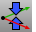 [Compress along Z](scale1d.html) 
Scale objects and distances smaller in the construction plane z&#160;direction.
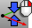 [Compress along World Z](scale1d.html) 
Scale objects and distances smaller in the world z&#160;direction.
 [DragMode](dragmode.html) 
Specify the plane object dragging will be parallel to.
Link to [Drag Mode toolbar](drag-mode-toolbar.html) 
 [Expand along X](scale1d.html) 
Scale objects and distances larger in the construction plane x&#160;direction.
 [Expand along World X](scale1d.html) 
Scale objects and distances larger in the world x&#160;direction.
 [Expand along Y](scale1d.html) 
Scale objects and distances larger in the construction plane y&#160;direction.
 [Expand along World Y](scale1d.html) 
Scale objects and distances larger in the world y&#160;direction.
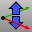 [Expand along Z](scale1d.html) 
Scale objects and distances larger in the construction plane z&#160;direction.
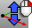 [Expand along World Z](scale1d.html) 
Scale objects and distances larger in the world z&#160;direction.
 [Hide](hide.html) 
Conceal objects from view.
Link to [Visibility toolbar](visibility-toolbar.html) 
 [Show](hide.html#show) 
Redisplay all hidden objects.
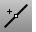 [InsertKnot](insertknot.html) 
Add knots to curves or surfaces.
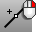 [InsertEditPoint](inserteditpoint.html) 
Add edit points to a curve.
 [Lasso](selection-commands.html#lasso) 
Select objects by drawing a freehand shape.
Link to [Select Points toolbar](select-points-toolbar.html) 
 [Move X+](move.html) 
Move one unit in the positive construction plane x&#160;direction.
 [Move World X+](move.html) 
Move one unit in the positive world x&#160;direction.
 [Move X-](move.html) 
Move one unit in the negative construction plane x&#160;direction.
 [Move World X-](move.html) 
Move one unit in the negative world x&#160;direction.
 [Move Y+](move.html) 
Move one unit in the positive construction plane y&#160;direction.
 [Move World Y+](move.html) 
Move one unit in the positive world y&#160;direction.
 [Move Y-](move.html) 
Move one unit in the negative construction plane y&#160;direction.
 [Move World Y-](move.html) 
Move one unit in the negative world y&#160;direction.
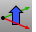 [Move Z+](move.html) 
Move one unit in the positive construction plane z&#160;direction.
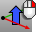 [Move World Z+](move.html) 
Move one unit in the positive world z&#160;direction.
 [Move Z-](move.html) 
Move one unit in the negative construction plane z&#160;direction.
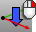 [Move World Z-](move.html) 
Move one unit in the negative world z&#160;direction.
 [PointsOn](pointson.html) 
Display curve and surface control points.
Link to [Point Edit toolbar](point-edit-toolbar.html) 
 [PointsOff](pointson.html#pointsoff) 
Turn off [control](pointson.html), [edit](pointson.html#editpton), and [solid](pointson.html#solidpton) points display.
 [RemoveKnot](insertknot.html#removeknot) 
Delete specified knots from a curve or surface.
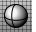 [Shaded viewport display mode](view-displaymode-options.html#shaded) 
Set the viewport to opaque shaded mode.
Link to [Display toolbar](display-toolbar.html) 
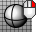 [Wireframe viewport display mode](view-displaymode-options.html#wireframe) 
Set the viewport display to unshaded wireframe.
&#160;
&#160;
Rhinoceros 6 © 2010-2015 Robert McNeel &amp; Associates.11-Nov-2015
 [Open topic with navigation](organic-toolbar.html) 

