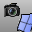

---
---

{: #kanchor1621}{: #kanchor1622}{: #kanchor1623}
# OrientCameraToSrf
 [Where can I find this command?](javascript:void(0);) Toolbars
 [Set View](set-view-toolbar.html) 
Menus
View
 [Viewport title](rhino-window.html#viewport-title-menu) 
Set Camera
Orient Camera to Surface
The OrientCameraToSrf command moves the viewport [camera](camera.html) and target locations to align along a selected [surface normal](dir.html).
Steps
 [Select](select-objects.html) a surface.Infinite Plane: TypeIPfor [InfinitePlane](infiniteplane.html) options.
 [Pick](pick-location.html) a point on the surface to point the viewport camera toward.Command-line options
Flip
Reverses the [direction](dir.html#normaldirection).
SetConstructionPlane
The viewport's construction plane is set to the modified view.
See also
 [Navigate in the viewports](sak-navigate.html) 
&#160;
&#160;
Rhinoceros 6 © 2010-2015 Robert McNeel &amp; Associates.11-Nov-2015
 [Open topic with navigation](orientcameratosrf.html) 

