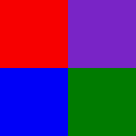
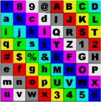

---
---

{: #kanchor1641}
# PackTextures
 [Where can I find this command?](javascript:void(0);) Toolbars
 [Render](render-tools-toolbar.html)  [Texture Tools](texture-tools-toolbar.html) 
Menus
 [Not on menus.](menuwhattodo.html) 
The PackTextures command packs the mesh textures of the selected polysurfaces.
When polysurfaces are meshed, the packed texture coordinates are created. A packed texture is a partition of the unit square into disjoint sub-rectangles so that one bitmap can be used to apply independent textures to each face of the polysurface.

Input polysurface each face designated by a color.

Packed texture applies over all faces in the polysurface.
Steps
 [Select](select-objects.html) objects.
# UnpackTextures
{: #unpacktextures}
 [Where can I find this command?](javascript:void(0);) Toolbars
 [Texture Tools](texture-tools-toolbar.html) 
Menus
 [Not on menus.](menuwhattodo.html) 
The UnpackTextures command unpacks the textures of selected polysurfaces.
See also
 [Use materials and textures](sak-materialsandtextures.html) 
&#160;
&#160;
Rhinoceros 6 © 2010-2015 Robert McNeel &amp; Associates.11-Nov-2015
 [Open topic with navigation](packtextures.html) 

