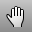

---
---

{: #kanchor1642}{: #kanchor1643}
# Pan
 [Where can I find this command?](javascript:void(0);) Toolbars
 [Set View](set-view-toolbar.html)  [Standard](standard-toolbar.html)  [View](view-toolbar.html) 
Menus
View
Pan
 [Viewport title](rhino-window.html#viewport-title-menu) 
Pan, Zoom, and Rotate
Pan View
Shortcut
 [Shift](shift-key.html) +
The Pan command shifts the location of the view camera and target parallel to the view plane.
Your browser does not support the video tag.Command-line options
Down
Pan the active view down.
Left
Pan the active view left.
Right
Pan the active view right.
Up
Pan the active view up.
In
Pan the active view in.
 [Ctrl](ctrl-key.html) +PageUp
Out
Pan the active view out.
 [Ctrl](ctrl-key.html) +PageUp
See also
 [Navigate in the viewports](sak-navigate.html) 
&#160;
&#160;
Rhinoceros 6 © 2010-2015 Robert McNeel &amp; Associates.11-Nov-2015
 [Open topic with navigation](pan.html) 

