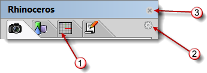

---
---

## Panel options
{: #kanchor2497}
Many Rhino controls are contained in tabbed panels. Open the panels from thePanelsmenu.

Tabs (1), Options icon (2), close button (3).
When the mouse is positioned over the tabs, the mouse wheel will scroll through the tabs.
To rearrange the tabs in the panel
Click and drag the tab to another position within the panel window.To make a tab stand alone
Click and drag the tab outside the panel window.To move the tab to another panel container window
Click and drag the tab to a different panel window.To open another panel in the same window
 [Right-click](right-mouse-click.html) the tab or click theOptionsiconand choose a panel from the menu.To open a tab in the window where it was previously stored
From thePanelsmenu, click a panel name.To close the panel window
Click theicon.
## Panel appearance options
Horizontal
Tabs appear in a horizontal row across the top of the window.
Vertical
Tabs appear in a vertical row along the right side of the window.
Tab size
Specifies the tab icon size.
Small / Medium / Large
Show panel text
Displays the panel name.

## Available panels
 [Box Edit](boxedit.html) 
 [Calculator](calc.html) 
 [Display](displayproperties.html) 
 [Environments](environmenteditor.html) 
Grasshopper
 [Ground Plane](groundplane.html) 
 [Help](help.html) 
 [Layer States](layerstatemanager.html) 
 [Layers](layer.html) 
 [Libraries](libraries.html#libraries) 
 [Lights](lights.html) 
 [Macro Editor](rhinoscripting.html#macroeditor) 
 [Materials](materialeditor.html) 
 [Mesh Repair](meshrepair.html) 
 [Named CPlanes](namedcplane.html) 
 [Named Positions](namedposition.html) 
 [Named Views](namedview.html) 
 [Notes](notes.html) 
 [Properties](properties.html) 
 [Rendering](rhino-render.html) 
 [RPN Calculator](calc.html#calcrpn) 
 [Sun](sun.html) 
 [Textures](texturepalette.html) 
 [Web Browser](webbrowser.html) 
Other panels may be added by plug-in applications.

## Other
Lock Docked Windows
Locks all panels and toolbars.
Help
Opens the Rhino Help in a panel.
See: [CommandHelp](help.html#commandhelp).
Close
Closes the panel.
 [Open topic with navigation](panel-options.html) 

