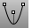
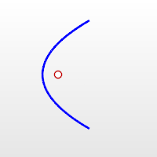
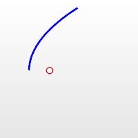

---
---

{: #kanchor1644}{: #kanchor1645}
# Parabola
 [Where can I find this command?](javascript:void(0);) Toolbars
 [Curve](curve-toolbar.html) 
Menus
Curve
Parabola
The Parabola command draws a parabolic curve.
Steps
Follow the prompts for the selected option. If no option is specified, the default is used.Your browser does not support the video tag.Command-line options{: #focus}{: #vertex}
MarkFocus
Places a point object at the focus location.

Half
Draws only half the parabola.

Focus
Pick a focus point, direction, and end location.
Focus steps
 [Pick](pick-location.html) the focus.Pick a direction.This is the open direction.Pick the end.The focus to vertex distance and length of the parabola display at the command prompt.Your browser does not support the video tag.Vertex
The Vertex option lets you pick a vertex point, a focus point, and an end location.
Vertex steps
 [Pick](pick-location.html) the vertex.Pick the focus.This is the open direction.Pick the end.The focus to vertex distance and length of the parabola display at the command prompt.Your browser does not support the video tag.See also
 [Draw lines and curves](sak-curve.html) 
&#160;
&#160;
Rhinoceros 6 © 2010-2015 Robert McNeel &amp; Associates.11-Nov-2015
 [Open topic with navigation](parabola.html) 

