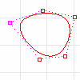
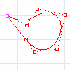

---
---

Periodic curves and surfaces
Periodic curve
A periodic curve is a smooth closed curve. Periodic curves stay smooth when you edit them.

Non-periodic curve
A non-periodic curve is a closed curve with a [kink](kink.html) at the start/end of the curve. Deforming non-periodic curves near the start of the curve may result in kinks.

Periodic surface
Periodic surfaces are closed surfaces (such as a cylindrical surface) that can be deformed without developing [kinks](kink.html). Periodic surfaces are automatically created when the input curves are periodic.

Non-periodic surface
A non-periodic surface is a closed surface with a [kink](kink.html) at the start/end of the surface. Deforming non-periodic surfaces near the start of the surface may result in kinks. Non-periodic surfaces are automatically created when the input curves are non-periodic.

 [Open topic with navigation](periodic.html) 

