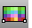
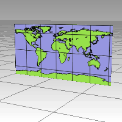
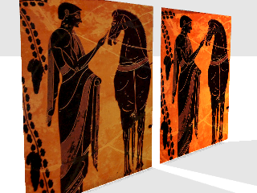

---
---

{: #kanchor1657}{: #kanchor1658}{: #kanchor1659}{: #kanchor1660}{: #kanchor1661}
# Picture
 [Where can I find this command?](javascript:void(0);) Toolbars
 [Plane](plane-toolbar.html)  [Surface Creation](surface-creation-toolbar.html)  [Surface Sidebar](surface-sidebar-toolbar.html)  [Viewport Layout](viewport-layout-toolbar.html) 
Menus
Surface
Plane
Picture Frame
The Picture command draws a rectangular planar surface with the specified image assigned to its material and sets the object to [Rendered](view-displaymode-options.html#rendered) display mode similar to using the [SetObjectDisplayMode](setobjectdisplaymode.html) command.

Steps
Select an image file.File types accepted are:
Transparency supported:&#160;
PNG (.png)Targa (.tga)TIFF (.tif; .tiff)Transparency not supported:
JPEG (.jpg; .jpeg)PCX (.pcx)Windows Bitmap (.bmp) [Pick](pick-location.html) a corner of the plane.Pick or type the length.The defining rectangle retains the same aspect (length to width) ratio as the image.Note
Isocurves and edges are turned off on picture objects in all display modes.Edit picture objects with the object's [Material Properties](material.html) .Command-line options
3Point
The 3Point option draws the defining rectangle using two adjacent corner locations and a location on the opposite side.
3Point steps
 [Pick](pick-location.html) the start of an edge.Pick the end of the edge.Pick the orientation.Vertical
The Vertical option draws the defining rectangle perpendicular to the construction plane.

Vertical steps
 [Pick](pick-location.html) the start of the edge.Pick the end of the edge or type a length.Center
The Center option draws the defining rectangle around a center point.
Center steps
 [Pick](pick-location.html) the center.Pick the other corner or type a length.1to1
The 1to1 option determines the width and height of the image in pixels, the resolution of the bitmap in dots-per-inch, and automatically scales the defining rectangle based on the model's current unit system.
1to1 steps
 [Pick](pick-location.html) the start of the edge.Pick a point to show the orientation.
# Picture material properties
{: #name}Name
Names the texture. All textures are automatically assigned a name. You can change this generic name.
When a texture or image file is dragged to a Rhino object, a material with that image is assigned to the object.
Picture
The Picture contains a simple bitmap image.
Texture
Name
The path and name of the bitmap file.
Self-illuminated
The SelfIllumination option causes the image to always display at full intensity and is not affected by light or shadow.

Self-Illumination off (left), and on (right).
Greyscale
Transparency
Specifies transparency settings for the image. Specify a transparent color to be used as an alpha channel in the case that no alpha channel is specified in the image.
Transparency is not supported when using JPEG (.jpg; .jpeg), PCX (.pcx), or Windows Bitmap (.bmp)
Use alpha channel
Specifies that the image alpha channel be used to determine transparency.
Use color mask
Specifies that a color in the image be used to determine transparency.
Color selector
Tol:
The tolerance to be used to determine if the texture's color matches the transparency color.
Object transparency
Sets the amount of transparency for the entire object.
Notes
Enter any notes that describe the texture. All textures have a Notes section.
See also
 [Create surfaces](sak-surface.html) 
&#160;
&#160;
Rhinoceros 6 © 2010-2015 Robert McNeel &amp; Associates.11-Nov-2015
 [Open topic with navigation](picture.html) 

