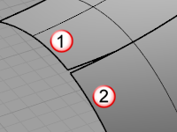
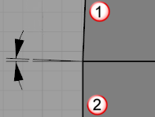
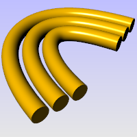
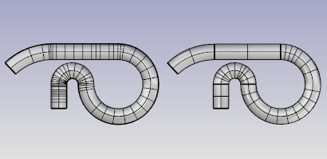

---
---

{: #kanchor1662}{: #kanchor1663}
# Pipe
 [Where can I find this command?](javascript:void(0);) Toolbars
 [Solids Sidebar](solids-sidebar-toolbar.html) 
Menus
Solid
Pipe
 [&#160;History enabled](historyenabled.html) 
&#160; [Extrusions enabled](extrusionsenabled.html) 
The Pipe command creates a surface with a circular profile around curves.
Steps
 [Select](select-objects.html) one curve. [Pick](pick-location.html) the start radius at the beginning of the pipe.If the curve is closed, pick the radius for the pipe.Pick the radius at the end of the pipe.Pick a point for the next radius, or press [Enter](enter-key.html) to end the command.Your browser does not support the video tag.Command-line options
ChainEdges
Selects surface edges that are touching the selected curve.
How to chain select
Select the first segment.ChainEdges options
AutoChain
Selecting a curve or surface edge automatically selects all curve segments connected with the level of [continuity](continuity-descriptions.html) set by the ChainContinuity option.
ChainContinuity
Controls the level of [continuity](continuity-descriptions.html) required between segments to be selected with theAutoChainoption.
Direction
Forward
Selects curves in the positive curve [direction](dir.html#normaldirection).
Backward
Selects curves in the negative curve [direction](dir.html#normaldirection).
Both
Selects curves in both the positive and negative curve [direction](dir.html#normaldirection).
GapTolerance
If the gap between two edges/curves is less than this value, the chain selection will ignore the gap and will select the next segment.

AngleTolerance
When Continuity is set to Tangency, if the angle between two edges/curves is less than this value, the chain selection will consider the criteria for continuity met and will select the next segment.

Undo
Undo last segment selection.
Next
Select next segment.
All
Select all segments.
Multipipe
Allows selecting more than one curve.

Pipe options
Diameter/Radius
Toggle between picking a Radius and picking a Diameter.
Thick
Determines whether the pipe has two walls or one.
Thick steps
 [Pick](pick-location.html) the first start radius.Pick the second start radius.Pick the first end radius.Pick the second end radius.Your browser does not support the video tag.Cap
Specifies how to cap the ends.
Your browser does not support the video tag.None
No cap.
Flat
Cap with planar surface.
Round
Cap with hemispherical surface.
FitRail
If the curve is a [polycurve](polycurve.html) of lines and arcs, the curve is [fit](fitcrv.html) and a single surface is created; otherwise the result is a polysurface with joined surfaces created from the polycurve segments.

FitRail=Yes (left) and FitRail=No (right).
ShapeBlending *(Single curve only)* 
Local
The pipe radius stays constant at the ends and changes more rapidly in the middle.
Your browser does not support the video tag.Global
The radius is linearly blended from one end to the other, creating pipes that taper from one radius to the other.
Your browser does not support the video tag.WallThickness *(Single curve only)* 
Specifies the value for the distance between the inside and outside of the pipe.
Negative numbers make the first radius the outer core.
See also
 [Create solid objects](sak-solid.html) 
&#160;
&#160;
Rhinoceros 6 © 2010-2015 Robert McNeel &amp; Associates.11-Nov-2015
 [Open topic with navigation](pipe.html) 

