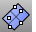

---
---

{: #kanchor1690}{: #kanchor1691}
# PlaneThroughPt
 [Where can I find this command?](javascript:void(0);) Toolbars
 [Plane](plane-toolbar.html)  [Surface Creation](surface-creation-toolbar.html)  [Surface Sidebar](surface-sidebar-toolbar.html) 
Menus
Surface
Plane
Through Points
The PlaneThroughPt command fits a rectangular planar surface through [point objects](points.html), [control points](controlpoint.html), [mesh vertices](meshvertex.html), or a [point cloud](pointcloud.html).
Steps
 [Select](select-objects.html) three or more [point objects](points.html), [control points](controlpoint.html), [mesh vertices](meshvertex.html), or a [point cloud](pointcloud.html) .Your browser does not support the video tag.See also
 [Create surfaces](sak-surface.html) 
&#160;
&#160;
Rhinoceros 6 © 2010-2015 Robert McNeel &amp; Associates.11-Nov-2015
 [Open topic with navigation](planethroughpt.html) 

