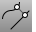
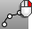
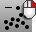

---
---

# Point toolbar
{: #kanchor2359}
 [To open a toolbar](javascript:void(0);) Toolbars can be opened as a free-standing group or added to the current group.
To open a toolbar as a free-standing group
Click theOptionsicon in any toolbar group.On the menu, clickShow Toolbar, and then select the toolbar name from the list.To open a toolbar as a new tab in the current group
Click theOptionsicon in the toolbar group where you want to add the new tab.On the menu, clickShow or Hide Tabs, and then select the toolbar name from the list. [ClosestPt](closestpt.html) 
Create a point object on an object at the nearest location to a base location or to another object.
 [ClosestPt, *Object* ](closestpt.html) 
Create a point between two objects.
 [CrvStart](crvstart.html) 
Place a point object at the start of a curve.
 [CrvEnd](crvstart.html#crvend) 
Place a point object at the end of a curve.
 [ExtractPt](extractpt.html) 
Duplicate curve control or edit points, surface control points, and mesh vertices.
 [Divide](divide.html) 
Create point objects along a curve by the number of equal length segments or segments of a specified length.
 [Divide, *Segments* ](divide.html) 
Create point objects along a curve by a number of segments.
 [DrapePt](drapept.html) 
Create a grid of points at the intersections of objects and points projected toward the construction plane.
 [MarkFoci](markfoci.html) 
Place point objects at focus locations of conic curves.
 [Point](point.html) 
Draw a single point object.
 [PointCloud](pointcloud.html) 
Create a set of vertices from point objects.
 [PointCloud, *Add* ](pointcloud.html) 
Add points to a point cloud.
 [PointCloud, *Remove* ](pointcloud.html) 
Remove points from a point cloud.
 [PointGrid](pointgrid.html) 
Draw a rectangular grid of point objects.
 [Points](points.html) 
Draw multiple point objects.
&#160;
&#160;
Rhinoceros 6 © 2010-2015 Robert McNeel &amp; Associates.11-Nov-2015
 [Open topic with navigation](point-toolbar.html) 

