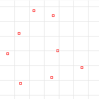
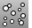

---
---

{: #kanchor1718}{: #kanchor1719}{: #kanchor1720}
# Point
 [Where can I find this command?](javascript:void(0);) Toolbars
 [Point](point-toolbar.html)  [Main2](main2-toolbar.html) 
Menus
Curve
Point Object
Single Point
The Point command draws a single point object at a specified location.

Steps
 [Pick a location](pick-location.html) for the point object.
# Points
{: #kanchor1723}
{: #kanchor1722}
{: #kanchor1721}
{: #points}
 [Where can I find this command?](javascript:void(0);) Toolbars
 [3-D Digitizing](3-d-digitizing-toolbar.html)  [Point](point-toolbar.html)  [Main2](main2-toolbar.html) 
Menus
Curve
Point Object
Multiple Points
The Points command draws multiple point objects.
Steps
 [Pick](pick-location.html) locations for the point objects, and press [Enter](enter-key.html) .See also
 [PointGrid](pointgrid.html) 
Draw a rectangular grid of point objects.
 [PointCloud](pointcloud.html) 
Create a set of vertices from point objects.
&#160;
&#160;
Rhinoceros 6 © 2010-2015 Robert McNeel &amp; Associates.11-Nov-2015
 [Open topic with navigation](point.html) 

