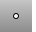

---
---

{: #kanchor1724}{: #kanchor1725}{: #kanchor1726}{: #kanchor1727}{: #kanchor1728}{: #kanchor1729}
# PointCloud
 [Where can I find this command?](javascript:void(0);) Toolbars
 [Point](point-toolbar.html) 
Menus
Curve
Point Cloud
Create Point Cloud
The PointCloud command creates a set of vertices from selected point objects or a mesh object to facilitate selection and faster display.
The point cloud object type improves Rhino's performance when handling a large number of point objects imported from external files.
You can use the point cloud object to group any number of individual points into a single object, minimizing the amount of storage in the 3DM file and maintaining performance. You can snap and select points in the cloud as if they were just point objects. A point cloud is similar to a mesh object that does not display any wires between vertices.
Steps
 [Select](select-objects.html) point objects, mesh objects, and point clouds.To create a point cloud from a mesh object
Select the mesh object first and then run thePointCloudcommand.To free all points in a point cloud
Use the [Explode](explode.html) command.Command-line options
Add
Adds points and point clouds to an existing point cloud.
Remove
Removes selected points from a point cloud.
See also
 [Point](point.html) 
Draw a single point object.
&#160;
&#160;
Rhinoceros 6 © 2010-2015 Robert McNeel &amp; Associates.11-Nov-2015
 [Open topic with navigation](pointcloud.html) 

