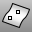

---
---

{: #kanchor1745}{: #kanchor1746}{: #kanchor1747}
# PointsFromUV
 [Where can I find this command?](javascript:void(0);) Toolbars
 [Surface Analysis](surface-analysis-toolbar.html) 
Menus
Analyze
Surface
Point from UV Coordinates
The PointsFromUV command create point objects at specified surface u and v&#160;coordinates.
Steps
 [Select](select-objects.html) a surface.Type a u&#160;value within the displayed [domain](domain.html) .Type a v&#160;value within the displayed domain, and press [Enter](enter-key.html) .When you select a [polysurface](polysurface.html), the result for the component surface at the location you pick is calculated. If the surface is trimmed, Rhino uses the untrimmed version of the surface.Command-line options
CreatePoint
Creates a point object on the surface.
Normalized
Yes
The u and v&#160;parameter ranges are scaled so that the output values are between zero and one (rather than using the real parameter value).
This is useful when you want to know the percentage along parameter space of the point you pick without having to calculate it based on the domain of the surface.
No
The unscaled u and v&#160;parameter values are given.
See: [Domain](domain.html).
See also
 [Draw point objects](sak-point.html) 
&#160;
&#160;
Rhinoceros 6 © 2010-2015 Robert McNeel &amp; Associates.11-Nov-2015
 [Open topic with navigation](pointsfromuv.html) 

