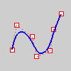
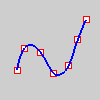

---
---

{: #kanchor880}{: #kanchor881}{: #kanchor882}{: #kanchor883}{: #kanchor884}{: #kanchor885}{: #kanchor886}{: #kanchor887}{: #kanchor888}{: #kanchor889}{: #kanchor890}{: #kanchor891}{: #kanchor892}{: #kanchor893}{: #kanchor894}{: #kanchor895}{: #kanchor896}{: #kanchor897}{: #kanchor898}{: #kanchor899}{: #kanchor900}{: #kanchor901}{: #kanchor902}{: #kanchor903}
# PointsOn
{: #pointson}
 [Where can I find this command?](javascript:void(0);) Toolbars
 [Curve Tools](curve-tools-toolbar.html)  [Geometry Fix](geometry-fix-toolbar.html)  [Main2](main2-toolbar.html)  [Organic](organic-toolbar.html)  [Point Edit](point-edit-toolbar.html)  [STL Tools](stl-tools-toolbar.html)  [Surface Tools](surface-tools-toolbar.html) 
Menus
Edit
Control Points
Control Points On
Shortcut
F10
The PointsOn command displays [control points](controlpoint.html).
Control points are coefficients of [NURBS](http://www.rhino3d.com/nurbs) basis functions. Sometimes also called *control vertex* or *node*.
Control points are used as "grips" on objects such as [curves](sak-curve.html), [surfaces](sak-surface.html), [lights](lights.html), [hatch boundaries](hatch.html), and [dimensions](dim.html) and cannot be separated from their objects.

Steps
 [Select](select-objects.html) objects.Note
When you control-point edit curves that are smooth and consist of several curve segments joined together, the curve will fuse into a single curve that cannot be exploded. If necessary you can use the [Split](split.html) command with thePointoption and [Knot](object-snaps.html#osnap-knot) object snap to break the curve into segments.To ensure the seams of [polysurfaces](polysurface.html) do not accidentally crack open, polysurface control points cannot be turned on. To control-point edit a polysurface, [Explode](explode.html) the object into separate surfaces first or use the [ExtractSrf](extractsrf.html) command to separate the surfaces you want to edit.While [control points](controlpoint.html) are on, they can be selected and deleted. This changes the shape of the curve or surface.
# Related commands

## PointsOff
{: #pointsoff}
 [Where can I find this command?](javascript:void(0);) Toolbars
 [Curve Tools](curve-tools-toolbar.html)  [Geometry Fix](geometry-fix-toolbar.html)  [Main1](main1-toolbar.html)  [Main2](main2-toolbar.html)  [Organic](organic-toolbar.html)  [Point Edit](point-edit-toolbar.html)  [STL Tools](stl-tools-toolbar.html)  [Surface Tools](surface-tools-toolbar.html) 
Menus
Edit
Control Points
Control Points Off
Shortcut
F11
The PointsOff command turns off [control points](controlpoint.html) and [edit points](#editpton) display.

## PtOffSelected
{: #ptoffselected}
 [Where can I find this command?](javascript:void(0);) Toolbars
 [Point Edit](point-edit-toolbar.html) 
Menus
 [Not on menus.](menuwhattodo.html) 
The PtOffSelected command turns off [control points](controlpoint.html) and [edit points](#editpton) for selected objects.

## SolidPtOn
{: #solidpton}
 [Where can I find this command?](javascript:void(0);) Toolbars
 [Solid Tools](solid-tools-toolbar.html) 
Menus
Solid
Solid Edit Tools
Turn On Points
The SolidPtOn command turns on grips at the ends of surface and joined polysurface edges, including closed solids.

## EditPtOn
{: #editpton}
 [Where can I find this command?](javascript:void(0);) Toolbars
 [Point Edit](point-edit-toolbar.html)  [Main1](main1-toolbar.html) 
Menus
Edit
Control Points
Show Edit Points
The EditPtOn command displays [edit points](editpoint.html) on the curve evaluated at [knot](knot.html) averages.

See also
 [Draw lines and curves](sak-curve.html) 
&#160;
&#160;
Rhinoceros 6 © 2010-2015 Robert McNeel &amp; Associates.11-Nov-2015
 [Open topic with navigation](pointson.html) 

